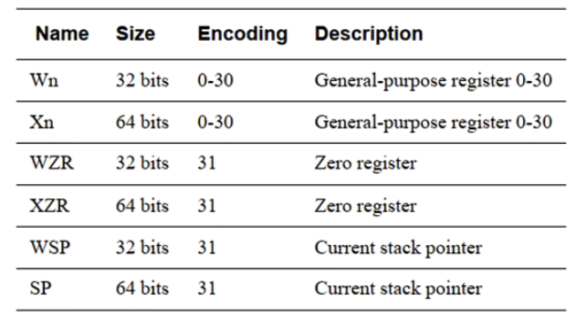

# ARM64指令

## 加载和存储指令

### A64汇编指令介绍

- A64指令集只能运行在aarch64环境中
- 所有A64汇编指令都是32bits宽
- A64支持全部都是大写或者全部都是小写的书写方式
- 寄存器命名：

### A64指令分类

- 内存加载和存储指令
- 多字节内存加载和存储
- 算数和移位指令
- 移位操作
- 位操作指令
- 条件操作
- 跳转指令
- 独占访存指令
- 内存屏障指令
- 异常处理指令
- 系统寄存器访问指令

### ldr指令

C6.2.109 P938

c6.2.132  P981
