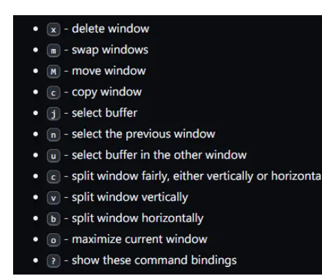

## 常用选中指令

| 指令          | 名字              | 效果                                     |
| ------------- | ----------------- | ---------------------------------------- |
| M - h         | mark-paragraph    | 选中段落                                 |
| C - x + C - p | mark-page         | 选中整个页面                             |
| C - x h       | mark-whole-buffer | 选中整个编辑窗口内容                     |
| M - y         | yank-pop          | 在C - y 之后使用，粘贴剪贴板内以前的项目 |

# emacs配置文件在windows上的位置

On Windows, the .emacs file may be called _emacs for backward compatibility with DOS and FAT filesystems where filenames could not start with a dot. Some users prefer to continue using such a name, because Explorer cannot create a file with a name starting with a dot, even though the filesystem and most other programs can handle it. In Emacs 22 and later, the init file may also be called.emacs.d/init.el. Many of the other files that are created by lisp packages are now stored in the.emacs.ddirectory too, so this keeps all your Emacs related files in one place.

All the files mentioned above should go in your HOME directory. The HOME directory is determined by following the steps below:

1. If the environment variableHOME is set, use the directory it indicates.
2. If the registry entry HKCU\SOFTWARE\GNU\Emacs\HOME is set, use the directory it indicates.
3. If the registry entry HKLM\SOFTWARE\GNU\Emacs\HOME is set, use the directory it indicates. Not recommended, as it results in users sharing the same HOME directory.
4. If C:.emacs exists, then use C:/. This is for backward compatibility, as previous versions defaulted to C:/ if HOME was not set.
5. Use the user's AppData directory, usually a directory called Application Data under the user's profile directory, the location of which varies according to Windows version and whether the computer is part of a domain.

也就是说，Emacs的配置文件有三种格式：.emacs文件、_emacs文件或者.emacs.d目录下的init.el（22或者更高版本）文件，但是，不管哪种格式，必须放对正确的目录Emacs才能找到，这个正确的目录就是HOME目录。

熟悉Linux的朋友一般都知道home目录，简单的用~表示，或者用全路径表示为/home/<xxx>，其中xxx表示用户名字，所以，在Linux下将.emacs和.emacs.d放到这个目录下就行了，但windows没有home目录的概念，所以，Emacs就按如下方式来查找配置文件：

1. 如果设置了HOME环境变量，那么就用它的值作为home目录~
2. 如果存在注册表键值HKCU\SOFTWARE\GNU\Emacs\HOME，就用它的值作为home目录~
3. 如果存在注册表键值HKLM\SOFTWARE\GNU\Emacs\HOME，就用它的值作为home目录~（和2的区别是，2只是针对当前用户的注册表路径，3则是针对所有用户）
4. 如果存在C:.emacs，就用C:\作为home目录~
5. 如果以上都不存在的话，就使用<system root>\Users<user name>\AppData\Roaming作为home目录~（对于XP和较早windows用户，需要到Documents and Settings目录下去找）

**从以上策略来看，1是比较好的做法，所以优先级也最高，应该是属于建议的方式，于是，新建一个HOME环境变量，将它的值设为想要放置Emacs配置文件的地方既可。**

**之前我是按以上方法设置的HOME目录，不过现在我后悔了，因为我发现不光是Emacs会使用HOME这个环境变量，会使用这个变量的至少还有以下程序或者插件：**

1. **VIM，VIM会把_viminfo文件放在这个目录；**
2. **VIM的neocomplcache插件，它会放置一个.neocon目录进去；**
3. **firefox的pentadactyl插件，它会放一个pentadactyl目录进去。**

**所以，个人建议：**

1. **如果你希望有一个公共的目录存放这些配置，就像Linux下的~目录一样，那么设置HOME这个环境变量最适合不过；**
2. **如果你希望这个目录只存放Emacs的配置，那么，还是不要用HOME环境变量了，去注册表里面添加一个HOME键值吧。（至少我个人比较偏向于这个方式）**

即：

在

HKEY_LOCAL_MACHINE\SOFTWARE下新建GNU项，在GNU项下新建Emacs项，然后Emacs新建一个字符串值，键为HOME,值为要存放的路径

# emacs turials

C：Ctrl

M: Alt

## 退出Emacs

**C-x C-c**

## 退出一个正在运行中的命令

**C-g**

## 移动到下一屏

**C-v**

## 移动到上一屏

**M-v**

## 重绘屏幕，将光标所在的行置于屏幕的中央

**C-l（这里是CTRL-L）**

## 基本光标控制

```plain
上一行 C-p
                              :
                              :
        向左移 C-b .... 目前光标位置 .... 向右移 C-f
                              :
                              :
                         下一行 C-n
```

每行文字都以一个“换行符”结束，“换行符”把行与行区分开来。（通常情况下，一个文件的最后一行会有一个换行符，但是 Emacs 不强制要求这一点。）

### 上一行

**C-p**

previous

### 下一行

**C-n**

next

### 向左移一个字符

**C-b**

backward

### 向右移一个字符

**C-f**

forward

### 光标向前移动一个词

这里词对于英文来说是一个英文单词，对于中文来说是移动到下一个标点符号

**M-f**

### 光标向后移动一个词

**M-b**

### 将光标移动到行头

**C-a**

ahead

### 将光标移动到行尾

**C-e**

end

### 将光标移动到一句的头部

**M-a**

### 将光标移动到一句的尾部

**M-e**

### 将光标移动到所有文字的最开头

**M-<**(实际上是alt+shift+,)

### 将光标移动到所有文字的最末尾

**M->**(实际上是alt+shift+.)

### 光标选中多个文字

**C-shift-r C-shift-f**

## 移动行块

```plain
(use-package drag-stuff
             :bind (("<M-up>" . drag-stuff-up)
                    ("<M-down>" . drag-stuff-down)))
```

**M-向上箭头**

## 互换顺序

### 光标前后两个字符互换

**C-t**

### 光标前后两个单词互换

**M-t**

## 复制

**M-w**

## 剪切

**C-w**

## 粘贴

**C-y**

yank

## 参数控制

大部分的Emacs命令接受数字参数，并且对于多数命令而言，这些数字参数的作用是**指定命令的重复次数**

**先输入C-u ，然后输入数字作为参数，最后再输入命令**

如： C-u 8 C-f 会向前移动8个字符

某些Emacs命令接收数字参数当作他用

比如： C-v 和 M-v

当给定一一个参数时，他们将滚动指定的行数而不是屏数

即C-u 8 C-v会将光标向下移动8行

## 窗格

### 关闭多余的窗格

**C-x 1**

只保留一个窗格，也就是关掉其它所有的窗格，将保留的窗格扩大到整个屏幕，同时关掉所有其它窗格

有一系列命令是以CONTROL-x开始的，这些命令许多都跟窗格，文件，缓冲区等等相关

## 插入

### 插入多个相同字符

**C-u 8** *****

这将会插入*********

## 删除

### 删除光标后的一个字符

**C-d**

delete

相当于键盘的delete键

### 删除光标后的一个词

**M-d**

### 删除光标到行尾之间的字符

**C-k**

kill

### 删除光标到句尾之间的字符

**M-k**

注意,“移除（kill）”和“删除（delete）”的不同在于被移除的东西可以被重新插入（在任何位置），而被删除的就不能使用相同的方法重新插入了（不过可以通过撤销一个删除命令来做到，后文会提到）。【实际上，移除掉的东西虽然看起来“消失”了，但实际上被 Emacs 记录了下来，因此还可以找回来；而删除掉的东西虽然也可能还在内存里，但是已经被 Emacs“抛弃”了，所以就找不回来了。】重新插入被移除的文字称为“召回（yank）”。一般而言，那些可能消除很多文字的命令会把消除掉的文字记录下来（它们被设定成了“可召回”），而那些只消除一个字符或者只消除空白的命令就不会记录被消除的内容（自然你也就无法召回了）。

注意，单独的 C-k 会把一行的内容移除，而第二个 C-k 则会移除换行符，并使其后所有的行都向上移动。C-k 处理数字参数的方式很特别，它会把参数指定的那么多行连同其后的换行符一起移除，而不仅仅是重复 C-k 而已。比如 C-u 2C-k 会把两行以及它们的换行符移除；而如果只是输入 C-k 两次显然不是这个结果。

## 召回（粘贴）

重新插入被移除的文字恢复的动作称为“召回（yanking）”。（就好像把别人从你身边移走的东西又猛力地拉回来。）你可以在你删除文字的地方召回，也可以在别的地方召回，还可以多次召回同样的文字以得到它的多个拷贝。很多其它的编辑器把移除和召回叫做“剪切”和“粘贴” 

### 召回最近一次移除的内容

**C-y**

yanking

### 召回前几次移除的内容

**M-y**

需要先C-y之后再M-y

## 撤销

**C-/**

或者 **C-_** 或者 **C-x u**

## 搜索

Emacs 可以向前或向后搜索字符串（“字符串”指的是一组连续的字符）。

搜索命令是一个**移动光标的命令**：搜索成功后，光标会停留在搜索目标出现的地方

### 向前搜索

**C-s**

在一次渐进式搜索中，Emacs 会尝试跳到搜索目标出现的位置。要跳到下一个命中位置，就再按一次 C-s。如果找不到目标，Emacs 会发出“哔”的一声，告诉你搜索失败。在整个过程中，都可以用 C-g 来终止搜索。【你会发现 C-g 会让光标回到搜索开始的位置，而 <Return> 则让光标留在搜索结果上，这是很有用的功能】

### 向后搜索

**C-r**

## 替换

**M-%**

替换时按下y确认替换，n跳过本处的替换，！全部替换

## 文件

### 寻找一个文件

**C-x C-f**

### 保存文件

**C-x C-s**

这条命令把 Emacs 中的文字存储到文件中。第一次存盘的时候 Emacs 会将原文件重命名以备份。重命名的规则通常是在原文件名之后添加一个“~”字符。可以关闭这个特性。

## 缓冲区

Emacs 把每个编辑中的文件都放在一个称为“缓冲区（buffer）”的地方。每寻找到一个文件，Emacs 就在其内部开辟一个缓冲区。用下面的命令可以列出当前所有的缓冲区：

   C-x C-b  列出缓冲区

输入 C-x 1 离开缓冲区列表

不管存在多少缓冲区，任何时候都只能有一个“当前”缓冲区，也就是你正在编辑的这个。如果你想编辑其它的缓冲区，就必须“切换”过去。上面讲过，用C-x C-f 是一种办法。不过还有一个更简单的办法，那就是用 C-x b。用这条命令，你必须输入缓冲区的名称。

大多数情况下，缓冲区与跟其对应的文件是同名的（不包括目录名），不过这也不是绝对的。用 C-x C-b 得到的缓冲区列表总是显示缓冲区名。

缓冲区未必有对应文件。显示缓冲区列表的缓冲区（叫做“*Buffer List*”）就是这样。这个 TUTORIAL.cn 缓冲区起初没有对应的文件，但是现在有了，因为在前一节你输入了 C-x C-s ， 将它保存成了一个文件。

“*Messages*”缓冲区也没有对应文件，这个缓冲区里存放的都是在 Emacs 底部出现的消息。

如果你对某个文件做了些修改，然后切换到另一个文件，这个动作并不会帮你把前一个文件存盘。对第一个文件的修改仍然仅存在于 Emacs 中，也就是在它对应的缓冲区里。并且，对第二个文件的修改也不会影响到第一个件。这很有用，但也意味着你需要一个简便的办法来保存第一个文件的缓冲区。先切换回那个缓冲区，再用 C-x C-s 存盘，太麻烦了。你需要一个更简便的方法，而 Emacs 已经为你准备好了：

   C-x s  保存多个缓冲区

C-x s 会找出所有已被修改但尚未存盘的缓冲区，然后向你逐个询问：是否需要存盘？

## 命令集扩展

Emacs 的命令就像天上的星星，数也数不清。把它们都对应到 CONTROL 和 META组合键上显然是不可能的。Emacs 用扩展（eXtend）命令来解决这个问题，扩展命令有两种风格：

```plain
C-x     字符扩展。  C-x 之后输入另一个字符或者组合键。
    M-x     命令名扩展。M-x 之后输入一个命令名
```

### 行排序

**M-x sort-lines**

### 统计字数

整个buffer统计

**M-x count-words-region**

选中区域统计

**M-x count-words**

## 自动保存

如果你已经修改了一个文件，但是还没来得及存盘你的计算机就罢工了，那么你所做的修改就很可能会丢失。为了避免这样的不幸发生，Emacs 会定期将正在编辑的文件写入一个“自动保存”文件中。自动保存文件的文件名的头尾各有一个“#”字符，比如你正在编辑的文件叫“hello.c”，那么它的自动保存文件就叫“#hello.c#”。这个文件会在常存盘之后被 Emacs 删除。

所以，假如不幸真的发生了，你大可以从容地打开原来的文件（注意不是自动保存文件）然后输入 M-x recover file <Return> 来恢复你的自动保存文件。在提示确认的时候，输入 yes<Return>。

## 状态栏

位于回显区正上方的一行被称为“状态栏”。状态栏上会显示一些信息，比如：

-:**- TUTORIAL.cn 63% L749 (Fundamental)

- 状态栏显示了 Emacs 的状态和你正在编辑的文字的一些信息。
- 你应该知道文件名的意思吧？就是你找到的那个文件嘛。
- -NN%-- 显示的是光标在全文中的位置。如果位于文件的开头，那么就显示 --Top-- 而不是 --00%--；如果位于文件的末尾，就显示 --Bot--。如果文件很小，一屏就足以显示全部内容，那么状态栏会显示 --All--。
- “L” 和其后的数字给出了光标所在行的行号。
- 最开头的星号（*）表示你已经对文字做过改动。刚刚打开的文件肯定没有被改动过，所以状态栏上显示的不是星号而是短线（-）。
- 状态栏上小括号里的内容告诉你当前正在使用的编辑模式。缺省的模式是Fundamental，就是你现在正在使用的这个。它是一种“主模式”。

## 模式

主模式都是可以用 M-x 启动的扩展命令，M-x fundamental-mode 就可以切换到 Fundamental模式。

M-x text-mode <Return>。切换到文本模式

用 C-h m 可以查看当前主模式的文档，输入 C-x 1 关掉文档窗格

- 主模式之所以称之为“主（major）”模式，是因为同时还有“辅模式”（minormode）存在。辅模式并不能替代主模式，而是提供一些辅助的功能。每个辅模式都可以独立地开启和关闭，跟其它辅模式无关，跟主模式也无关。所以你可以不使用辅模式，也可以只使用一个或同时使用多个辅模式。
- 有一个叫做自动折行（Auto Fill）的辅模式很有用，特别是在编辑自然语言文本的时候。启用自动折行后，Emacs 会在你打字超出一行边界时自动替你换行。
- 用 M-x auto-fill-mode <Return> 启动自动折行模式。再用一次这条命令，自动折行模式会被关闭。也就是说，如果自动折行模式没有被开启，这个命令会开启它；如果已经开启了，这个命令会关闭它。所以我们说，这个命令可以用来开关（toggle）”模式。
- 行边界通常被设定为 70 个字符【这里指英文字符】，你可以用 C-x f 命令配合数字参数来重新设定它。
- 如果你在段落的中间做了一些修改，那么自动折行模式不会替你把整个段落重新折行，你需要用 M-q 手动折行。注意，光标必须位于你需要折行的那一段里

## 窗口管理

Buffer切换

C-x b

杀死当前Buffer

C-x k

批量管理Buffer

C-x C-b ;; 进入Buffer列表

- d ;; 标记删除
- u ;; 取消当前行标记
- U ;; 取消全部标记
- x ;; 执行操作
- ? ;; 查看按键帮助

## 多窗格（分屏）

### 将屏幕划分为两个窗格

**C-x 0**

关闭当前分屏

**C-x 1**

只保留当前分屏

**C-x 2**

上下分屏

**C-x 3**

左右分屏

### 分屏宽度调整

增加高度 C-x ^

增加/减少宽度 C-x {C-x }

### 将光标移动到其它窗格

**C-x o**

o指的是other

当你在一个窗格中编辑，但用另一个窗格作为参考的时候，C-M-v 是很有用的命令。无需离开被选中的窗格，你就可以用 C-M-v 命令滚动另外一个窗格中的文字。【比如翻译和校对就很适合用这种方式进行。】

（在上方窗格里）输入 C-x 1 关掉下方窗格

当分屏很多的时候效率非常低。通过ace-window可快速进行窗口间的跳转。类似的插件较多，但该款为最佳方案。

**M-o**

```plain
(use-package ace-window 
             :bind (("M-o" . 'ace-window)))
```



### 在新窗格里打开文件

**C-x 4 C-f**

## 多窗口

### 新建一个窗口

**M-x make-frame**

### 关闭选中窗口

**M-x delete-frame**

## 获得更多帮助

Emacs 提供了一些命令来查看 Emacs 的命令文档，这些命令都以 CONTROL-h 开头，这个字符也因此被称为“帮助（Help）字符”

最基本的帮助功能是 C-h c。输入 C-h c 之后再输入一个组合键，Emacs 会给出这个命令的简要说明。

输入 C-h c C-p。

显示的消息应该会是这样：

​    C-p runs the command previous-line

这条消息显示了 C-p 命令对应的函数名。命令的功能由函数完成，所以函数名本身也可以被看成是最简单的文档――至少对于你已经学过的命令来说，它们的函数名足以解释它们的功能了。

想得到更多的信息，请把 C-h c 换成 C-h k 试试看。

输入 C-h k C-p。

上面的命令会新打开一个 Emacs 窗格以显示函数的名称及其文档。你读完之后可以用 C-x 1 关掉这个帮助窗格。当然你并不需要立即这样做，你完全可以先在编辑窗格里做点别的事情，然后再关掉帮助窗格。

C-h f 解释一个函数。需要输入函数名。

输入 C-h f previous-line <Return>。Emacs 会给出它所知道的所有有关“实现 C-p 命令功能的函数”的信息

C-h v 用来显示 Emacs 变量的文档。Emacs 变量可以被用来“定制 Emacs 的行为”。同样，你需要输入变量的名称。

C-h a 相关命令搜索（Command Apropos）。 输入一个关键词然后 Emacs 会列出所有命令名中包含此关键词 的命令。这些命令全都可以用 M-x 来启动。对于某些命令来说， 相关命令搜索还会列出一两个组合键。

输入 C-h a file <Return>。

Emacs 会在另一个窗格里显示一个 M-x 命令列表，这个列表包含了所有名称中含有“file”的命令。你可以看到像“C-x C-f”这样的组合键显示在“find-file”这样的命令名的旁边。

C-h i 阅读手册（也就是通常讲的 Info）。 这个命令会打开一个称为“*info*”的特殊缓冲区，在那里， 你可以阅读安装在系统里的软件包使用手册。要读 Emacs 的使 用手册，按 m emacs <Return> 就可以了。如果你之前从没用 过 Info 系统，那么请按“?”，Emacs 会带你进入 Info 的使 用指南。在看完本快速指南之后，Emacs Info 会成为你的主要 参考文档。