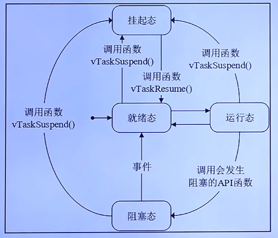

**RTOS**: Real Time OS

FreeRTOS一共支持三种任务调度方式：

- 抢占式调度
- 时间片调度
- 协程式调度

抢占式调度针对优先级不同的任务，高优先级的任务可以打断低优先级的任务；
时间片调度针对优先级相同的任务,同等优先级任务轮流地享有相同的CPU时间（可设置），叫时间片，在FreeRTOS中，一个时间片就等于SysTick中断周期，没有用完的时间片不会再使用，下次任务得到执行还是按照一个时间片的时钟节拍运行
协程调度，当前执行的任务将会一直运行，同时高优先级任务不会抢占低优先级任务

FreeRTOS中任务优先级的数值设置的越大，优先级越高

FreeRTOS中任务共存在4种状态

- 运行态
- 就绪态
- 阻塞态
- 挂起态

正在执行的任务就是运行态
如果该任务已经能够被执行，但当前还未被执行，该任务就处于就绪态
如果一个任务因延时或等待外部事件发生，那么这个任务就处于阻塞态
挂起态类似与暂停，调用vTaskSuspend()进入挂起态，需要调用解除挂起的函数vTaskResume()才能进入就绪态

这四种状态，除了运行态，其他三种状态的任务都有其对应的任务状态列表：就绪列表，阻塞列表，挂起列表
- 就绪列表 pxReadyTaskLists[x]，其中x代表让任务优先级的数值，如果是软件的方式，是无限制的，如果是硬件的方式则为0~31（32位）
- 阻塞列表 pxDelayedTaskList
- 挂起列表 xSuspendedTaskList

调度器总是在所有处于就绪列表的任务中选择具有最高优先级的任务来执行

https://github.com/FreeRTOS/FreeRTOS/archive/refs/tags/202112.00.zip