## 1.Kubernetes简述和特性

### 1.1 k8s简述

- k8s是谷歌在2014年开源的容器化集群管理系统
- 使用k8s进行容器化应用部署
- 使用k8s利于应用扩展
- k8s目标是是让部署容器化应用更简洁和高效


### 1.2 k8s功能

1. 自动装箱
2. 自动修复(自愈能力)
3. 水平扩展
4. 服务发现
5. 滚动更新
6. 版本回退
7. 密钥和配置管理(类似热部署)
8. 存储编排
9. 批处理

### 1.3 k8s集群架构组件

Master(主控节点)和Node(工作节点)

(1) master组件

- apiserver

集群统一入口，以restful方式，交给etcd存储

- scheduler

节点调度，选择node节点应用部署

- controller-manager

处理集群中常规后台任务，一个资源对应一个控制器

- etcd

存储系统,用于保存集群相关的数据

(2) node组件

- kubeelet

master派到node节点的代表，管理本机容器

- kube-proxy

提供网络代理，实现负载均衡等操作

## 

### 1.4 k8s核心概念

1. Pod

- 最小部署单元
- 一组容器的集合
- 共享网络
- 生命周期是短暂的

1. Controller

- 确保预期的pod副本数量
- 无状态应用部署
- 有状态应用部署
- 确保所有的node运行同一个pod
- 一次性任务和定时任务

1. Service

- 定义一组pod的访问规则


- **Master（主节点）：** 控制 Kubernetes 节点的机器，也是创建作业任务的地方。
- **Node（节点）：** 这些机器在 Kubernetes 主节点的控制下执行被分配的任务。
- **Pod：** 由一个或多个容器构成的集合，作为一个整体被部署到一个单一节点。同一个 pod 中的容器共享 IP 地址、进程间通讯（IPC）、主机名以及其它资源。Pod 将底层容器的网络和存储抽象出来，使得集群内的容器迁移更为便捷。
- **Replication controller（复制控制器）：** 控制一个 pod 在集群上运行的实例数量。
- **Service（服务）：** 将服务内容与具体的 pod 分离。Kubernetes 服务代理负责自动将服务请求分发到正确的 pod 处，不管 pod 移动到集群中的什么位置，甚至可以被替换掉。
- **Kubelet：** 这个守护进程运行在各个工作节点上，负责获取容器列表，保证被声明的容器已经启动并且正常运行。
- **kubectl：** 这是 Kubernetes 的命令行配置工具


### 1.5 k8s集群搭建

1. 搭建环境平台规划

- 单master集群


缺点:master挂掉就寄了

- 多master集群


高可用的集群

1. 服务器硬件配置要求

- 测试环境：

master: 2核 4G 20G

node: 4核 8G 40G

- 生产环境：

更高要求

1. 搭建k8s集群部署方式

- kubeadm

一个k8s部署工具，提供kubeadmin init 和kubeadm josin，用于快速部署kubernetes集群

- 二进制包

从github下载发行版二进制包，各个组件要单独部署


#### 1.5.1 kubeadm方式搭建

https://kubernetes.io/zh-cn/docs/setup/production-environment/tools/kubeadm/install-kubeadm/

```bash
# 设置服务器hostname
$ hostnamectl set-hostname <hostname>
$ yum install -y kubelet-1.18.0 kubeadm-1.18.0 kubectl-1.18.0
# 设置开机启动
$ systemctl enable kebelet
# 部署Kubernetes Master,在master节点上执行
# 由于默认拉取镜像地址 k8s.gcr.io 国内无法访问，这里指定阿里云镜像仓库地址
$ kubeadm init \
--apiserver-advertise-address=192.168.31.61 \
--image-repository registry.aliyuncs.com/google_containers \
--kubernetes-version v1.17.0 \
--service-cidr=10.96.0.0/12 \
--pod-network-cidr=10.244.0.0/16
# 使用 kubectl 工具
$ mkdir -p $HOME/.kube
$ sudo cp -i /etc/kubernetes/admin.conf $HOME/.kube/config
$ sudo chown $(id -u):$(id -g) $HOME/.kube/config
# 查看目前的节点
$ kubectl get nodes
# 加入 Kubernetes Node
# 在 192.168.31.62/63（Node节点而不是master节点）执行
# 向集群添加新节点，执行在 kubeadm init 输出的 kubeadm join 命令
$ kubeadm join 192.168.31.61:6443 --token esce21.q6hetwm8si29qxwn \
--discovery-token-ca-cert-hash
sha256:00603a05805807501d7181c3d60b478788408cfe6cedefedb1f97569708be9c5
# 安装 Pod 网络插件
$ kubectl apply –f https://raw.githubusercontent.com/coreos/flannel/master/Documentation/kube-flannel.yml
# 测试 kubernetes 集群
# 在 Kubernetes 集群中创建一个 pod，验证是否正常运行：
$ kubectl create deployment nginx --image=nginx
$ kubectl expose deployment nginx --port=80 --type=NodePort
$ kubectl get pod,svc
```


1. 安装3台虚拟机，安装操作系统
2. 对三个安装之后的操作系统进行初始化操作
3. 在三个节点安装docker kubelet,kubeadm kubectl,更改docker源
4. 在master节点执行kubeadm init命令进行初始化
5. 在node节点上执行kubeadm join命令把node节点添加到当前集群里面


#### 1.5.2 二进制包搭建


1. 创建多台虚拟机，安装Linux操作系统
2. 操作系统初始化
3. 为etcd和apiserver自签证书
4. 部署etcd集群
5. 部署master组件

kube-apiserver,kube-controller-manager,kube-scheduler,etcd

1. 部署node组件

kebelet,kube-proxy,docker,etcd

1. 部署集群网络


### 1.6 k8s集群命令行工具kubectl

kubectl是Kubernetes集群的命令行工具,通过kubectl能够对集群本身进行管理，并能够在集群上进行容器化应用的安装部署

```bash
$ kubectl [command] [type] [name] [flags]
$ kubectl --help
```

### 1.7 yaml文件说明

#### 1.7.1 文件书写格式

- 通过缩进表示层级关系

- 不能用tab键表示缩进

- : 后加一个空格

- 一般开头缩进两个空格

- 字符后缩进一个空格

- --- 表示一个新的yaml文件的开始

- 使用#代表注释

  

#### 1.7.2 yaml文件示例


| 字段       | 说明       |
| ---------- | ---------- |
| apiVersion | Api版本    |
| kind       | 资源类型   |
| metadata   | 资源元数据 |
| spec       | 资源规格   |
| replicas   | 副本数量   |
| selector   | 标签选择器 |
| template   | Pod模板    |
| metadata   | Pod元数据  |
| spec       | Pod规格    |
| container  | 容器配置   |

#### 1.7.3 如何快速编写yaml文件 

1. 使用**kubectl create**命令生成yaml文件

```bash
$ kubectl create deployment web --image=nginx -o yaml --dry-run > web1.yaml
```

   

## 2.Kubernetes核心技术

### 2.1 Pod

#### 2.1.1 Pod概述

1. Pod是k8s系统中可以创建(部署)和管理的最小单元

2. k8s不会直接处理容器,而是Pod,Pod可以包含多个容器(一组容器的集合)

3. 一个pod中共享网络命名空间
4. 每一个Pod都有一个特殊的被称为"根容器"的Pause容器。Pause容器对应的镜像属于k8s平台的一部分,除了Pause容器,每个Pod还包含一个或者多个紧密相关的用户业务容器。
5. Pod是短暂的

#### 2.1.2 Pod存在的意义

1. 创建容器使用docker，一个docker对应一个容器，一个容器有进程，一个容器运行一个应用程序
2. Pod是多进程设计，可以运行多个应用程序；一个Pod有多个容器，一个容器里面运行一个应用程序
3. Pod存在是为了亲密性交互: 
   - 两个应用之间进行交互
   - 网络之间进行调用
   - 两个应用需要频繁调用

#### 2.1.3 Pod实现机制

1. 共享网络

容器本身是相互隔离的，k8s利用Pod的Pause容器(info容器)，吧其他业务容器加入到Pause容器中，让所有业务容器在同一个名称空间中，可以实现网络共享


2. 共享存储

Pod持久化数据：日志数据，业务数据

使用Volume数据卷进行持久化存储


#### 2.1.4 Pod镜像拉取策略


**imagePullPolicy**

IfNotPresent: 默认值，镜像在宿主机上不存在时才拉取

Always: 每次创建Pod都会拉取一次镜像

Never: Pod永远不会主动拉取这个镜像,需要手动拉取


#### 2.1.5 Pod资源限制


1c = 1000m(1核cpu)

#### 2.1.7 Pod重启机制


**restartPolicy**

Always: 当容器终止推出后，总是重启容器，默认策略

OnFailure: 当容器异常退出(退出状态码非0)时才重启容器

Never: 当容器终止推出时，从不重启容器

#### 2.1.8 Pod健康检查

容器检查：

检测不出java堆内存溢出(状态还是running)


应用层面健康检查：


echo $?表示linux上一条命令是否执行成功


#### 2.1.9 创建Pod流程


- master节点

createpod -- apiserver -- etcd 

scheducler -- apiserver --etcd -- 调度算法,吧pod调度到某个node节点上

- node节点

kubelet --apiserver --读取etcd拿到分配给当前节点pod --docker创建容器


**影响调度的属性**

1. pod资源限制: resources

2. 节点选择器标签影响Pod调度


需要先对节点打标签

```bash
$ kubectl label node k8snode1 env_role=prod
$ kubectl get nodes k8snode1 --show-labels
```

3. 节点亲和性影响Pod调度


**节点亲和性** nodeAffinity和之前nodeSelector基本一样的,根据节点上标签约束来决定Pod调度到哪些节点上

(1) 硬亲和性(requireDuringSchedulingIgnoreDuringExecution)

约束条件必须满足

(2) 软亲和性(preferredDuringSchedulingIgnoredDuringExecution)

尝试满足，不保证


常用的操作符(operator):

In NotIn Exists Gt Lt DoesNotExists


**反亲和性**:使用NotIn和DoesNotExists


4. 污点和污点容忍


- 基本介绍：

nodeSelector和nodeAffinity: Pod调度到某些节点上,Pod属性,调度的时候实现

Taint污点: 节点不做普通分配调度,是节点属性


- 场景

专用节点

配置特点硬件节点

基于Taint驱逐

```bash
# 查看当前节点的污点情况
$ kubectl describe node k8smaster | grep Taint
```

污点值有三个:

NoSchedule: 一定不被调度

PreferNoSchedule: 尽量不被调度

NoExecute: 不会调度,而且还会驱逐Node已有Pod


为节点添加污点

kubectl taint node [node] key=value:污点三个值

```bash
$ kubectl get pods
$ kubectl create deployment web --image=nginx
$ kubectl get pods -o wide
# 再创建4个
$ kubectl scale deployment web --replicas=5
$ kubectl taint node [node] key=value
# 删除pod
$ kubectl delete deployment web
$ kubectl get pods
No resources found in default namespace
$ kubectl taint node k8snode1 env_role=yes:NoSchedule
$ kubectl describe node k8snode1 | grep Taint

```

删除污点

```bash
$ kubectl taint node k8snode1 env_role:NoSchedule-
$ kubectl describe node k8snode1 | grep Taint
```


污点容忍:


### 2.2 Controller

#### 2.2.1 什么是Controller

在集群上管理和运行容器的对象

#### 2.1.2 Pod和Controller关系

- Pod通过Controller实现应用的运维，比如伸缩，滚动升级等

  - Pod 和Controller之间通过label标签建立关系

  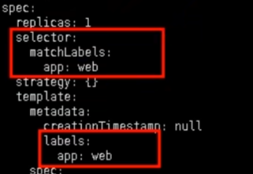

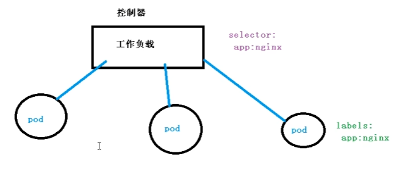

#### 2.1.3 deployment应用场景

- 部署无状态应用
- 管理Pod和ReplicaSet
- 部署，滚动升级等功能

应用场景: web服务,微服务

#### 2.1.4 使用deployment部署应用(yaml)

```bash
# 导出yaml文件
$ kubectl create deployment web --image=nginx --dry-run -o yaml > web.yaml
# 使用yaml部署y
$ kubectl apply -f web.yaml
$ kubectl get nodes
# 对外发布,暴露端口
$ kubectl expose deployment web --port=80 --type=NodePort --target-port=80 --name=web1 -o yaml > web1.yaml
$ kubectl apply -f web1.yaml
$ kubectl get nodes -o wide
```

#### 2.1.5 应用升级回滚和弹性伸缩

```bash
# 应用升级
$ kubectl set image deployment web nginx=nginx:1.15
# 查看升级状态
$ kubectl rollout status deployment web
# 查看历史版本
$ kubectl rollout history deployment web
# 还原到上一个版本
$ kubectl rollout undo deployment web
# 弹性伸缩
$ kubectl scale deployment web --replicas=10
```

#### 2.1.6 无状态和有状态的区别

1. 无状态
   - 认为Pod都是一样的(副本都是一样的)
   - 没有顺序要求
   - 不用考虑在哪个node运行
   - 随意进行伸缩和扩展
2. 有状态
   - 上面因素都需要考虑到
   - 让每个pod独立，保持pod启动顺序和唯一性(唯一的网络标识符，持久存储，有序，比如mysql主从)


#### 2.1.7 部署有状态的应用

- 无头service: 
  - ClusterIP: node

**StatefulSet**部署有状态应用

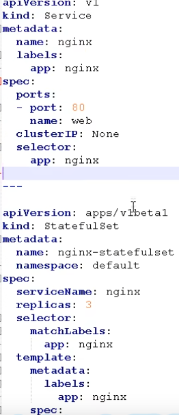

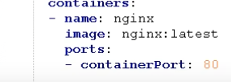

执行后查看pod，有3个Pod，每个都是唯一的名称

查看svc, ClusterIP为None


deployment和statefulset区别:有身份的(唯一标识的)

- 根据主机名+按照一定规则生成域名
- 唯一域名

格式： 主机名称.service名称.名称空间.svc.cluster.local

example: nginx-statefulset-0.nignx.default.svc

#### 2.1.8 部署守护进程DaemonSet

- 在每个node上运行一个pod，新加入的node也同样运行在一个Pod里面
- 例子：在每个node节点安装数据采集工具

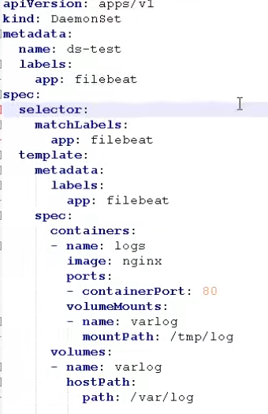

```bash
$ kubectl delete statefulset --all
$ kubectl delete svc nginx
$ kubectl delete svc web
$ kubectl apply -f ds.yaml
$ kubectl exec -it ds-test-cbk6cv bash
```

#### 2.1.9 job(一次性任务)和cronjob(定时任务)

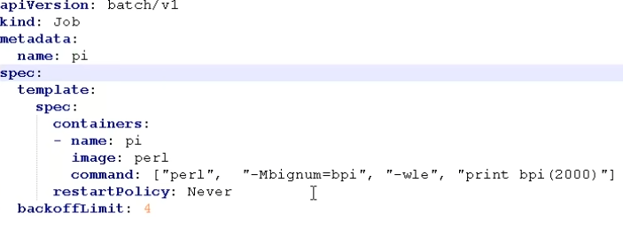


```bash
$ kubectl create -f job.yaml
$ kubectl get pods -o wide
$ kubectl get jobs
pi-qpqff Completed
$ kubectl logs pi-qpqff
# 删除
$ kubectl delete -f job.yaml
```

 


定时任务:

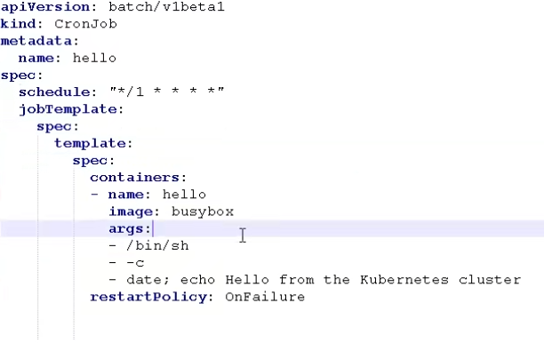

```bash
$ kubectl apply -f cronjob.yaml
$ kubectl get pods
$ kubectl get cronjobs
$ kubectl logs hello-1599100140-wkn79
```

每次执行状态bian'wei


### 2.3 Service

#### 2.3.1 Service 是什么

定义一组Pod的访问规则

#### 2.3.2 Service存在意义

- 防止Pod失联(服务发现)

  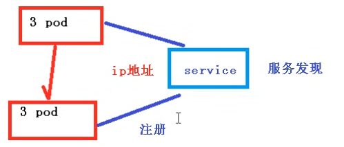

- 定义一组Pod访问策略(负载均衡)

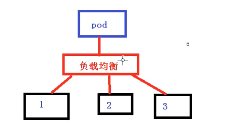

#### 2.3.4 Pod和Service的关系

根据label标签建立关系

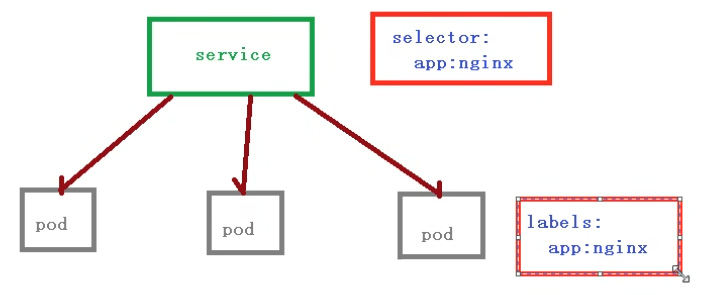

#### 2.3.5 常用Service类型

1. ClusterIP: 集群内部使用
2. NodePort: 对外访问应用使用
3. LoadBalancer: 对外访问应用使用,公有云

```bash
$ kubectl get svc
$ kubectl expose deployment web --port=80 --target-port=80 --dry-run -o yaml > service1.yaml
$ kubectl apply -f service1.yaml
$ kubectl get svc
```

node 内网部署应用,外网一般不能访问到:

用一台可以进行外网访问的机器，安装nginx,反向代理

手动把可以访问节点添加到nginx

LoadBalancer: 公有云，把负载均衡,控制器

### 2.4 配置管理

#### 2.4.1 Secret

作用： 加密数据存在etcd里面，让Pod容器以挂载Volume的方式进行访问

场景:    凭证


base64编码

```bash
$ echo -n "admin" | base64
```


1.创建secret加密数据

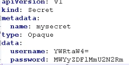

```bash
$ kubectl create -f secret.yaml
$ kubectl get secret
```

2. 以变量的形式挂载到pod容器中

valueForm

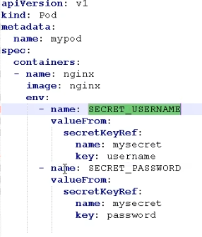

```bash
$ kubectl apply -f secret-val.yaml
$ kubectl get pods
$ kubectl exec -it mypod bash
$ echo $SECRET_USERNAME
```

3. 以Volume挂在到数据卷中


```bash
$ kubectl delete -f secret-val.yaml
$ kubectl apply -f secret-vol.yaml
$ kubectl get pods
$ kubectl exec -it mypod bash
$ ls /etc/foo
$ cat /etc/foo/username
```

#### 2.4.2 ConfigMap

作用：存储不加密数据到etcd中,让Pod以变量或者Volume挂载到容器中

场景：配置文件


1.创建配置文件

```bash
$ kubectl delete secret --all
$ kubectl delete Pod --all
$ vim redis.properties
```

2.创建configmap

```bash
$ kubectl create configmap redis-config --from-file=redis.properties
# 查看
$ kubectl get cm
$ kubectl describe cm redis-config
```

3.以Volume挂在到Pod容器中

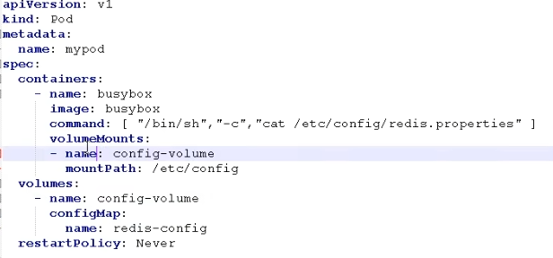

```bash
$ kubectl apply -f cm.yaml
# 查看日志
$ kubectl logs mypod
```

4.以变量形式挂载

（1）创建yaml,声明变量信息configmap创建

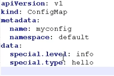

（2）以变量挂载

```bash
$ kubectl apply -f myconfig.yaml
$ kubectl get cm
```

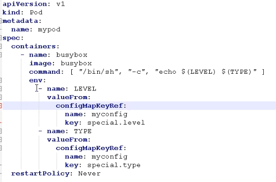

```bash
$ kubectl apply -f config-var.yaml
$ kubectl get pods
$ kubectl get cm
$ kubectl logs mypod
```

### 2.5 k8s集群安装机制

#### 2.5.1概述

1. 访问k8s集群的时候要经过三个步骤完成具体操作

   (1) 认证

   (2) 鉴权(授权)

   (3) 准入控制

2. 进行访问的时候，过程中都需要经过apiserver，apiserver做统一协调,比如门卫,访问过程中需要证书,token，或者用户名+密码，如果访问pod需要serviceAccount


第一步认证 

- 传输安全: 对外不暴露8080端口,只能内部访问,对外使用端口6443
- 认证： 客户端身份认证常用方式：
  - https证书认证,基于ca证书
  - http token认证,通过token识别用户
  - http 基本认证,用户名+密码认证


第二步 鉴权

- 基于RBAC进行鉴权操作
- 基于角色访问控制


第三步 准入控制

- 就是准入控制器的列表,如果列表友情就内容就通过


#### 2.5.2 RBAC 基于角色的访问控制

Role Based Access Control

1. 角色

- role: 角色,特定命名空间的访问权限

- clusterRole: 对所有命名空间的访问权限

``` bash
# 查看命名空间
$ kubectl get ns
# 创建命名空间
$ kubectl create ns roletest
```


2. 角色绑定

- roleBinding: 角色绑定到主题
- ClusterRoleBinding: 集群角色绑定到主体


3. 主体

- user: 用户
- group: 用户组
- serviceAccount: 服务账号


#### 2.5.3 RBAC实现鉴权

```bash
# 1.创建命名空间
$ kubectl create ns roledemo
# 2.在新的命名空间下创建一个Pod
$ kubectl run nginx --image=nginx -n roledemo
```


```bash
# 3.创建角色
$ vim rbac-role.yaml
$ kubectl apply -f rbac-role.yaml
# 查看命名空间下的角色
$ kubectl get role -n roledemo
```

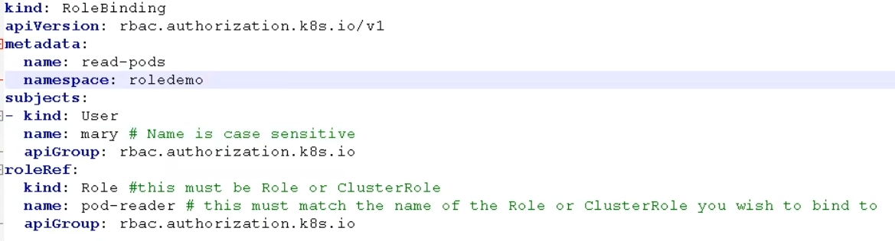

```bash
# 4.创建角色绑定
$ vim rbac-rolebing.yaml
$ kubectl apply -f rbac-rolebinding.yaml
$ kubectl get role,rolebinding -n roledemo
```

5. 使用证书

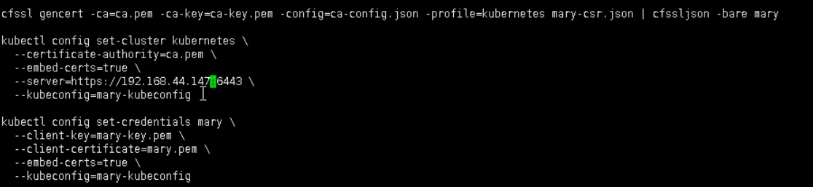

```bash
$ vim rbac-user.sh
$ cp /root/TLS/k8s/ca* ./
$ bash rbac.sh
$ kubectl get pods -n roledemo
```

### 2.6 Ingress

#### 2.6.1 概述

1. 把端口号对外暴露，通过ip+端口号进行访问,使用Service里面的NodePort实现
2. NodePort缺陷

- 在每个节点上都会起到端口，在访问时候通过任何节点,通过节点ip+暴露端口实现访问
- 意味着灭个端口只能使用一次,一个端口对应一个应用
- 实际访问中都是用域名，根据不同的域名跳转到不同端口服务中


#### 2.6.2 Ingress和Pod关系

- pod和ingress通过service关联的
- ingress作为统一入口,由service关联一组pod

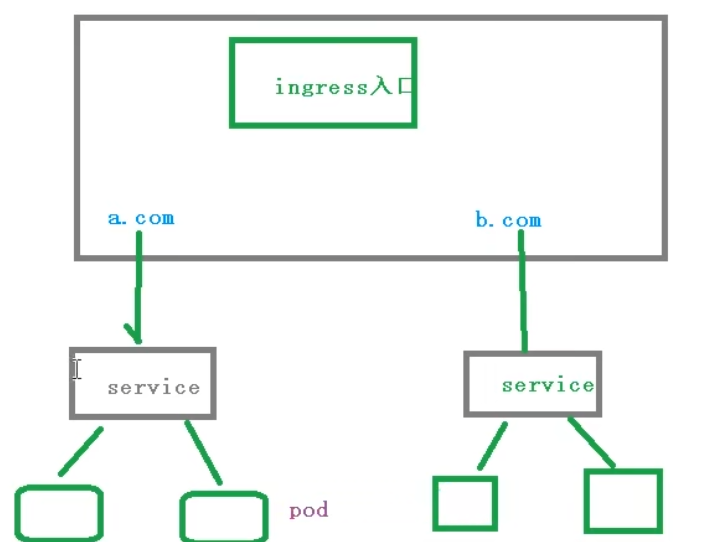


#### 2.6.3 使用ingress

使用Ingress对外暴露应用

1. 创建nginx应用,对外暴露端口使用

```bash
$ kubectl create deployment web --image=nginx
$ kubectl get pods
$ kubectl get deploy
$ kubectl expose deployment web --port=80 --target-port=80 --type=NodePort
$ kubectl get svc
```

2. 部署ingress controller

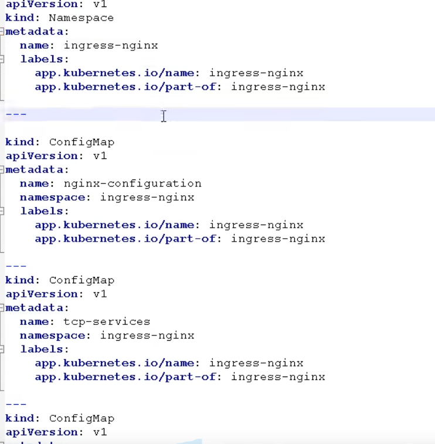

```bash
$ kubectl apply -f ingress-con.yaml
# 查看ingress controller状态
$ kubectl get pods -n ingress-nginx
# 创建ingress规则
```

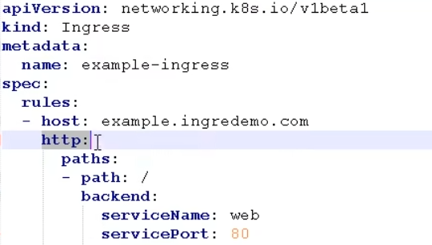

```bash
$ vim ingress-h.yaml
$ kubectl apply -f ingress-h.yaml
$ kubectl get pods -n ingress-nginx -o wide
$ kubectl get ing
```

### 2.7 Helm

#### 2.7.1 概述

之前部署应用的基本过程：

​    编写yaml文件: deployment,Service,Ingress


如果使用之前方式部署单一应用,少数服务的应用,比较合适

如果部署微服务项目,可能有几十个服务，每个服务都有一套yaml文件，需要维护大量yaml文件，版本管理特别不方便


使用helm可以解决哪些问题？

1. 使用helm可以把这些yaml作为一个整体管理
2. 实现yaml高效服用
3. 使用helm应用级别的版本管理


**helm介绍**

Helm是一个k8s的包管理工具,就像Linux下的包管理器如yum/apt等，可以很方便的将之前打包好的yaml文件部署到k8s上


**三个重要概念**

- helm
  - 是一个命令行客户端工具

- Chart
  - 是把yaml打包，是yaml集合

- Release
  - 基于chart部署实体,应用级别的版本管理


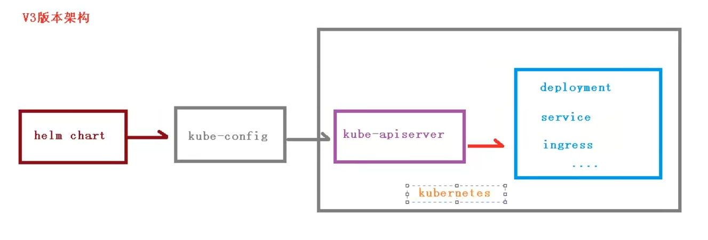

https://helm.sh/docs/intro/quickstart/


**安装**

https://helm.sh/docs/intro/install/

**添加仓库**

```bash
$ helm repo add brigade https://brigadecore.github.io/charts
"brigade" has been added to your repositories
$ helm search repo brigade
```

#### 2.7.2 使用helm快速部署应用

1. 使用命令搜索应用

```bash
$ helm search repo 名称
```

2. 根据搜索内容选择安装

```bash
$ helm install 安装之后的名称 搜索之后的名称
```

3. 查看安装后的状态

```bash
$ helm list
$ helm status 安装后的名称
```

example

```bash
$ helm search repo weave
$ helm install ui stable/weave-scope
$ kubectl get pods
$ kubectl get svc
# 发现没有暴露端口需要改nodePort
$ kubectl edit svc ui-weave-scope
```

#### 2.7.3 如何自己创建Chart

1. 使用命令创建chart

```bash
$ helm create mychart
$ cd mychart
```

- Chart.yaml： 当前chart属性配置信息
- templates: 编写yaml文件放到这个目录中
- values.yaml： yaml文件可以使用的全局变量


2. 在templates文件夹下创建两个yaml文件

- deployment.yaml
- service.yaml

```bash
$ kubectl create deployment web1 --images=nginx --dry-run -o yaml > deployment.yaml
$ kubectl create deployment web1 --image=nginx
$ kubectl expose deployment web1 --port=80 --target-port=80 --type=NodePort --dry-run -o yaml > service.yaml
$ kubectl delete deployment web1

```

3. 安装mychart

```bash
$ helm install web1 mychart/
$ kubectl get pods
$ kubectl get svc
```

4.应用升级

```bash
$ helm upgrade chart名称 chart文件夹
# example
$ helm upgrade web1 mychart/
```

#### 2.7.4 实现yaml高效服用

通过传递参数,动态渲染模板,yaml内容动态传入参数生成

1. 在values.yaml定义变量和值
2. 在具体yaml文件中获取定义变量和值


- yaml文件大体上有这几个地方是不同的
  - image
  - tag
  - label
  - port
  - replicas


一.在values.yaml定义变量和值

```yaml
replicas: 1
image: nginx
tag: 1.16
label: nginx
port: 80
```

二.在templates的yaml文件中使用values.yaml定义变量

- 通过表达式形式使用全局变量

{{.Values.变量名称}}

比如{{ .Release.Name}}-deploy

{{.Values.image}}

```bash
$ helm install --dry-run web2 mychart/
```

### 2.8 持久化存储

数据卷 emptydir,是本地存储,pod重启,数据不存在了,需要对数据持久化存储

#### 2.8.1 nfs 网络存储

pod重启,数据还是在的


第一步 找一台服务器nfs服务端

(1) 安装nfs

```bash
$ yum install -y nfs-utils
```

(2) 设置挂载路径

```bash
$ vim /etc/exports
/data/nfs *(rw.no_root_squash)
```

(3) 对外挂在路径需要先创建出来

```bash
$ mkdir /data/nfs
```


第二步 在k8s集群node节点上安装nfs

```bash
$ yum install -y nfs-utils
```


第三步 在nfs服务器启动nfs服务

```bash
$ systemctl start nfs
$ ps -elf | grep nfs
```


第四步 在k8s集群中部署应用使用nfs持久网络存储

```bash
$ mkdir pv
$ cd pv
$ vim nfs-nginx.yaml
```

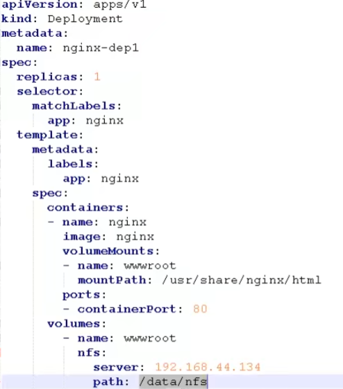

```bash
$ kubectl describe pod nginx-dep1-79x79jg79-9sn8gx
```

#### 2.8.2 PV和PVC

1. PV: 持久化存储，对存储资源进行抽象，对外提供可以调用的地方(生产者)
2. PVC: 用户调用不需要关心内部实现细节(消费者)
3. 实现流程：

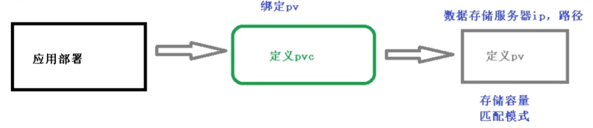

```bash
$ vim pvc.yaml
```

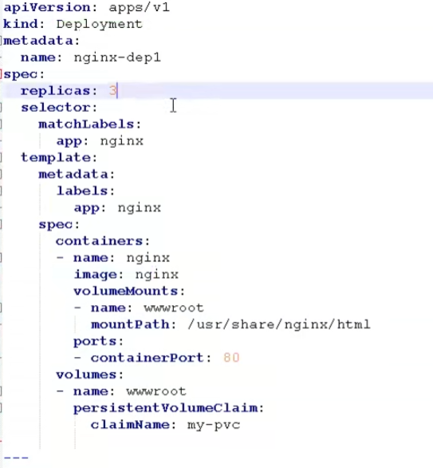

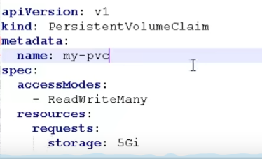

```bash
$ kubectl apply -f pvc.yaml
```

```bash 
$ vim pv.yaml
```

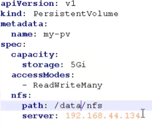

```bash
$ kubectl apply -f pv.yaml
$ kubectl get pv,pvc
$ kubectl get pods
$ kubectl exec -it nginx-dep1-79u99x9g68s bash
$ ls /usr/share/nginx/html
```


### 2.9 k8s集群资源架空

#### 2.9.1 监控指标

1. 集群监控
   - 节点资源利用率
   - 节点数
   - 运行pods
2. Pod监控
   - 容器指标
   - 应用程序

#### 2.9.2 监控平台

prometheus+Grafana

(1) prometheus

- 开源的
- 监控，报警，数据库
- 以HTTP协议周期性抓取被监控的组件状态
- 不需要复杂的继承过程,使用http接口接入就可以了

(2) Grafana

- 开源的数据分析和可视化工具
- 支持多种数据源


部署：

https://developer.aliyun.com/article/836300

## 3.搭建高可用集群

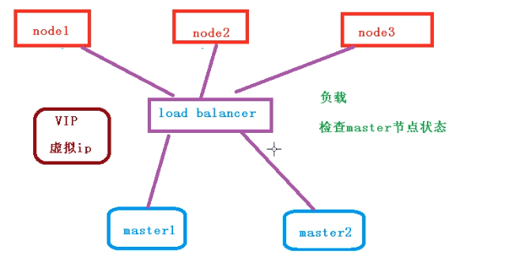

#### 3.1 高可用集群技术

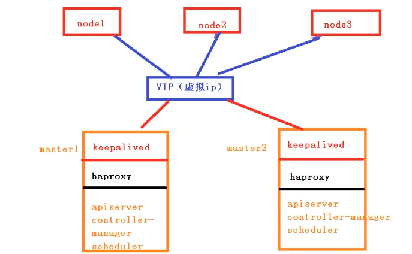

#### 3.2 部署

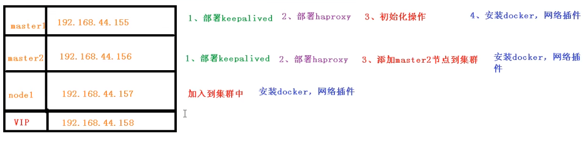

https://kubernetes.io/zh-cn/docs/setup/production-environment/tools/kubeadm/high-availability/

## 4.部署一个java项目

#### 4.1容器交付流程

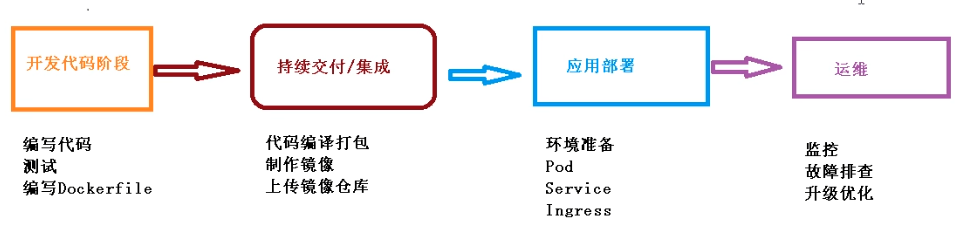

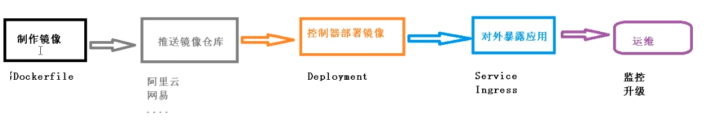
