## 1.Kubernetes简述和特性

### 1.1 k8s简述

- k8s是谷歌在2014年开源的容器化集群管理系统
- 使用k8s进行容器化应用部署
- 使用k8s利于应用扩展
- k8s目标是是让部署容器化应用更简洁和高效


### 1.2 k8s功能

1. 自动装箱
2. 自动修复(自愈能力)
3. 水平扩展
4. 服务发现
5. 滚动更新
6. 版本回退
7. 密钥和配置管理(类似热部署)
8. 存储编排
9. 批处理

### 1.3 k8s集群架构组件

Master(主控节点)和Node(工作节点)

(1) master组件

- apiserver

集群统一入口，以restful方式，交给etcd存储

- scheduler

节点调度，选择node节点应用部署

- controller-manager

处理集群中常规后台任务，一个资源对应一个控制器

- etcd

存储系统,用于保存集群相关的数据

(2) node组件

- kubeelet

master派到node节点的代表，管理本机容器

- kube-proxy

提供网络代理，实现负载均衡等操作

## 

### 1.4 k8s核心概念

1. Pod

- 最小部署单元
- 一组容器的集合
- 共享网络
- 生命周期是短暂的

1. Controller

- 确保预期的pod副本数量
- 无状态应用部署
- 有状态应用部署
- 确保所有的node运行同一个pod
- 一次性任务和定时任务

1. Service

- 定义一组pod的访问规则


- **Master（主节点）：** 控制 Kubernetes 节点的机器，也是创建作业任务的地方。
- **Node（节点）：** 这些机器在 Kubernetes 主节点的控制下执行被分配的任务。
- **Pod：** 由一个或多个容器构成的集合，作为一个整体被部署到一个单一节点。同一个 pod 中的容器共享 IP 地址、进程间通讯（IPC）、主机名以及其它资源。Pod 将底层容器的网络和存储抽象出来，使得集群内的容器迁移更为便捷。
- **Replication controller（复制控制器）：** 控制一个 pod 在集群上运行的实例数量。
- **Service（服务）：** 将服务内容与具体的 pod 分离。Kubernetes 服务代理负责自动将服务请求分发到正确的 pod 处，不管 pod 移动到集群中的什么位置，甚至可以被替换掉。
- **Kubelet：** 这个守护进程运行在各个工作节点上，负责获取容器列表，保证被声明的容器已经启动并且正常运行。
- **kubectl：** 这是 Kubernetes 的命令行配置工具


### 1.5 k8s集群搭建

1. 搭建环境平台规划

- 单master集群


缺点:master挂掉就寄了

- 多master集群


高可用的集群

1. 服务器硬件配置要求

- 测试环境：

master: 2核 4G 20G

node: 4核 8G 40G

- 生产环境：

更高要求

1. 搭建k8s集群部署方式

- kubeadm

一个k8s部署工具，提供kubeadmin init 和kubeadm josin，用于快速部署kubernetes集群

- 二进制包

从github下载发行版二进制包，各个组件要单独部署


#### 1.5.1 kubeadm方式搭建

https://kubernetes.io/zh-cn/docs/setup/production-environment/tools/kubeadm/install-kubeadm/

```bash
# 设置服务器hostname
$ hostnamectl set-hostname <hostname>
$ yum install -y kubelet-1.18.0 kubeadm-1.18.0 kubectl-1.18.0
# 设置开机启动
$ systemctl enable kebelet
# 部署Kubernetes Master,在master节点上执行
# 由于默认拉取镜像地址 k8s.gcr.io 国内无法访问，这里指定阿里云镜像仓库地址
$ kubeadm init \
--apiserver-advertise-address=192.168.31.61 \
--image-repository registry.aliyuncs.com/google_containers \
--kubernetes-version v1.17.0 \
--service-cidr=10.96.0.0/12 \
--pod-network-cidr=10.244.0.0/16
# 使用 kubectl 工具
$ mkdir -p $HOME/.kube
$ sudo cp -i /etc/kubernetes/admin.conf $HOME/.kube/config
$ sudo chown $(id -u):$(id -g) $HOME/.kube/config
# 查看目前的节点
$ kubectl get nodes
# 加入 Kubernetes Node
# 在 192.168.31.62/63（Node节点而不是master节点）执行
# 向集群添加新节点，执行在 kubeadm init 输出的 kubeadm join 命令
$ kubeadm join 192.168.31.61:6443 --token esce21.q6hetwm8si29qxwn \
--discovery-token-ca-cert-hash
sha256:00603a05805807501d7181c3d60b478788408cfe6cedefedb1f97569708be9c5
# 安装 Pod 网络插件
$ kubectl apply –f https://raw.githubusercontent.com/coreos/flannel/master/Documentation/kube-flannel.yml
# 测试 kubernetes 集群
# 在 Kubernetes 集群中创建一个 pod，验证是否正常运行：
$ kubectl create deployment nginx --image=nginx
$ kubectl expose deployment nginx --port=80 --type=NodePort
$ kubectl get pod,svc
```


1. 安装3台虚拟机，安装操作系统
2. 对三个安装之后的操作系统进行初始化操作
3. 在三个节点安装docker kubelet,kubeadm kubectl,更改docker源
4. 在master节点执行kubeadm init命令进行初始化
5. 在node节点上执行kubeadm join命令把node节点添加到当前集群里面


#### 1.5.2 二进制包搭建


1. 创建多台虚拟机，安装Linux操作系统
2. 操作系统初始化
3. 为etcd和apiserver自签证书
4. 部署etcd集群
5. 部署master组件

kube-apiserver,kube-controller-manager,kube-scheduler,etcd

1. 部署node组件

kebelet,kube-proxy,docker,etcd

1. 部署集群网络


### 1.6 k8s集群命令行工具kubectl

kubectl是Kubernetes集群的命令行工具,通过kubectl能够对集群本身进行管理，并能够在集群上进行容器化应用的安装部署

```bash
$ kubectl [command] [type] [name] [flags]
$ kubectl --help
```

### 1.7 yaml文件说明

#### 1.7.1 文件书写格式

- 通过缩进表示层级关系

- 不能用tab键表示缩进

- : 后加一个空格

- 一般开头缩进两个空格

- 字符后缩进一个空格

- --- 表示一个新的yaml文件的开始

- 使用#代表注释

  

#### 1.7.2 yaml文件示例

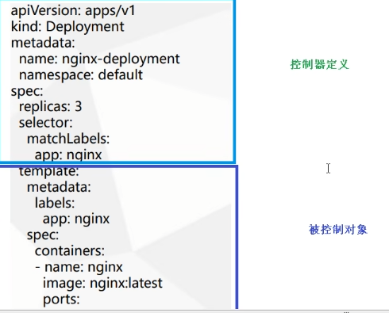

| 字段       | 说明       |
| ---------- | ---------- |
| apiVersion | Api版本    |
| kind       | 资源类型   |
| metadata   | 资源元数据 |
| spec       | 资源规格   |
| replicas   | 副本数量   |
| selector   | 标签选择器 |
| template   | Pod模板    |
| metadata   | Pod元数据  |
| spec       | Pod规格    |
| container  | 容器配置   |

#### 1.7.3 如何快速编写yaml文件 

1. 使用**kubectl create**命令生成yaml文件

```bash
$ kubectl create deployment web --image=nginx -o yaml --dry-run > web1.yaml
```

   

## 2.Kubernetes核心技术

### 2.1 Pod

#### 2.1.1 Pod概述

1. Pod是k8s系统中可以创建(部署)和管理的最小单元

2. k8s不会直接处理容器,而是Pod,Pod可以包含多个容器(一组容器的集合)

3. 一个pod中共享网络命名空间
4. 每一个Pod都有一个特殊的被称为"根容器"的Pause容器。Pause容器对应的镜像属于k8s平台的一部分,除了Pause容器,每个Pod还包含一个或者多个紧密相关的用户业务容器。
5. Pod是短暂的

#### 2.1.2 Pod存在的意义

1. 创建容器使用docker，一个docker对应一个容器，一个容器有进程，一个容器运行一个应用程序
2. Pod是多进程设计，可以运行多个应用程序；一个Pod有多个容器，一个容器里面运行一个应用程序
3. Pod存在是为了亲密性交互: 
   - 两个应用之间进行交互
   - 网络之间进行调用
   - 两个应用需要频繁调用

#### 2.1.3 Pod实现机制

1. 共享网络

容器本身是相互隔离的，k8s利用Pod的Pause容器(info容器)，吧其他业务容器加入到Pause容器中，让所有业务容器在同一个名称空间中，可以实现网络共享


2. 共享存储

Pod持久化数据：日志数据，业务数据

使用Volume数据卷进行持久化存储


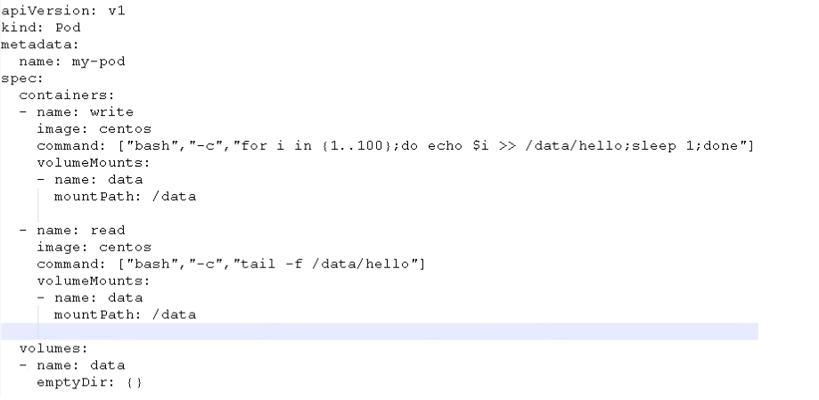

#### 2.1.4 Pod镜像拉取策略

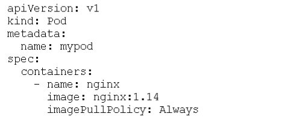

**imagePullPolicy**

IfNotPresent: 默认值，镜像在宿主机上不存在时才拉取

Always: 每次创建Pod都会拉取一次镜像

Never: Pod永远不会主动拉取这个镜像,需要手动拉取


#### 2.1.5 Pod资源限制

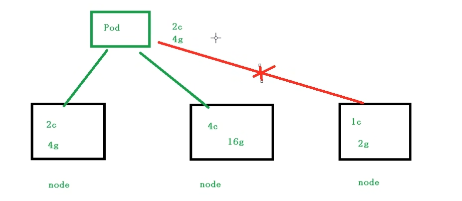


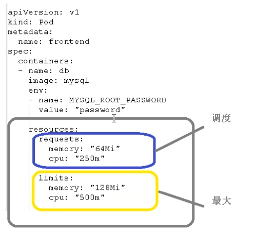

1c = 1000m(1核cpu)

#### 2.1.7 Pod重启机制

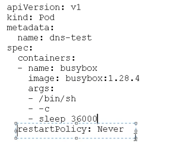

**restartPolicy**

Always: 当容器终止推出后，总是重启容器，默认策略

OnFailure: 当容器异常退出(退出状态码非0)时才重启容器

Never: 当容器终止推出时，从不重启容器

#### 2.1.8 Pod健康检查

容器检查：

检测不出java堆内存溢出(状态还是running)


应用层面健康检查：

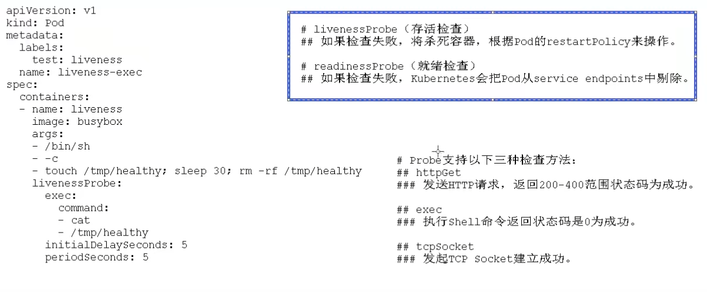

echo $?表示linux上一条命令是否执行成功


#### 2.1.9 创建Pod流程

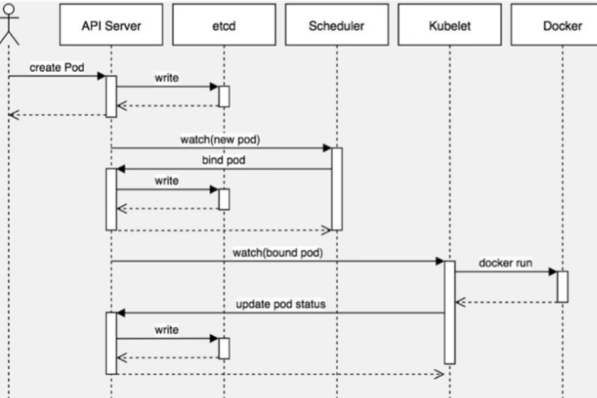

- master节点

createpod -- apiserver -- etcd 

scheducler -- apiserver --etcd -- 调度算法,吧pod调度到某个node节点上

- node节点

kubelet --apiserver --读取etcd拿到分配给当前节点pod --docker创建容器


**影响调度的属性**

1. pod资源限制: resources

2. 节点选择器标签影响Pod调度

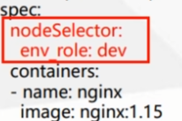

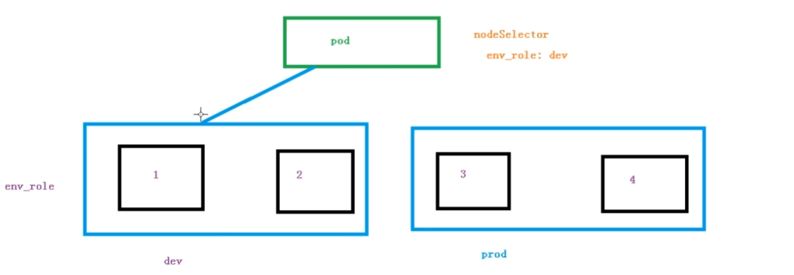

需要先对节点打标签

```bash
$ kubectl label node k8snode1 env_role=prod
$ kubectl get nodes k8snode1 --show-labels
```

3. 节点亲和性影响Pod调度


**节点亲和性** nodeAffinity和之前nodeSelector基本一样的,根据节点上标签约束来决定Pod调度到哪些节点上

(1) 硬亲和性(requireDuringSchedulingIgnoreDuringExecution)

约束条件必须满足

(2) 软亲和性(preferredDuringSchedulingIgnoredDuringExecution)

尝试满足，不保证


常用的操作符(operator):

In NotIn Exists Gt Lt DoesNotExists


**反亲和性**:使用NotIn和DoesNotExists


4. 污点和污点容忍


- 基本介绍：

nodeSelector和nodeAffinity: Pod调度到某些节点上,Pod属性,调度的时候实现

Taint污点: 节点不做普通分配调度,是节点属性


- 场景

专用节点

配置特点硬件节点

基于Taint驱逐

```bash
# 查看当前节点的污点情况
$ kubectl describe node k8smaster | grep Taint
```

污点值有三个:

NoSchedule: 一定不被调度

PreferNoSchedule: 尽量不被调度

NoExecute: 不会调度,而且还会驱逐Node已有Pod


为节点添加污点

kubectl taint node [node] key=value:污点三个值

```bash
$ kubectl get pods
$ kubectl create deployment web --image=nginx
$ kubectl get pods -o wide
# 再创建4个
$ kubectl scale deployment web --replicas=5
$ kubectl taint node [node] key=value
# 删除pod
$ kubectl delete deployment web
$ kubectl get pods
No resources found in default namespace
$ kubectl taint node k8snode1 env_role=yes:NoSchedule
$ kubectl describe node k8snode1 | grep Taint

```

删除污点

```bash
$ kubectl taint node k8snode1 env_role:NoSchedule-
$ kubectl describe node k8snode1 | grep Taint
```


污点容忍:

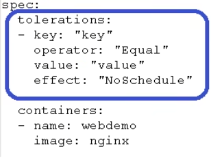


