# 内存管理

## 关于地址

**地址空间不隔离**

1.恶意的进程可以随意修改别的进程的内存

2.内存使用的效率很低，如当内存短缺时需要把进程中的所有数据交换到交换分区


- 早期内存的使用方法

  - 分段（主要思想：将虚拟地址空间与物理地址空间做一一的映射，程序运行需要全部装载到内存中）
  - 分页（主要思想：程序运行时，需要哪个页面才分配哪个页面，即按需分配，长期不需要的可以交换到磁盘中）

- 逻辑地址（Intel 专用术语，产生的和段相关的偏移地址那个部分）
- 线性地址（Intel 专用术语，逻辑地址转换到物理地址的一个中间层，在分段中，逻辑地址是段偏移地址，再加上基地址即变成线性地址）

- 虚拟地址
- 物理地址（CPU 通过外部总线访问物理内存需要的地址）

- 进程地址空间

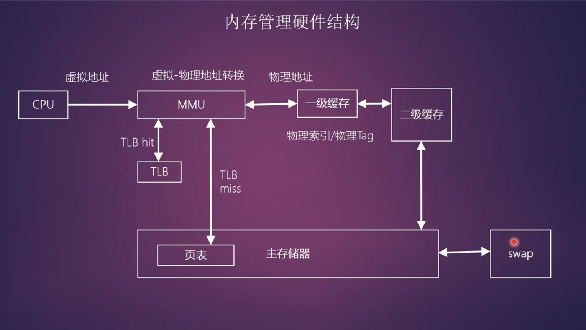

TLB也称快表，缓存了页表转换的页表项

## 页表映射

### arm32

- 支持四级映射
  - 全局目录项 **PGD** （**Page Global Directory**）
  - 上级目录项 **PUD** （**Page Upper Directory**）
  - 中间目录项 **PMD** （**Page Middle Directory**）
  - 页表项 （**Page Table**）

Linux内核最早是基于x86做的，因此内核代码中常用上面这个术语

**虚拟地址到物理地址的转换**


**一级页表表项**

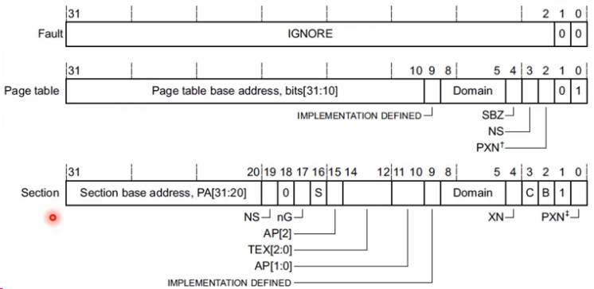

- Fault
  - 错误的表项
- Page table
  - 一级页表的表项
  - bit[0~1]:用来表示这个页表项是一级页表还是段映射的表项
  - PXN：PL1是否可以执行这段代码，为0表示可执行，为1表示不可执行
  - NS: non security bit表示安全扩展的比特位
  - Domain: 指明所属的域，Linux只用到了3个域
  - bits[31:10] Page table base address 指向二级页表的基地址

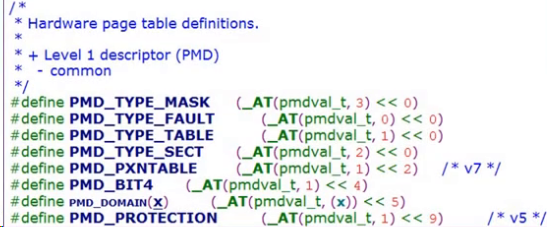

- Section
  - 段映射的段表项

**二级页表表项**

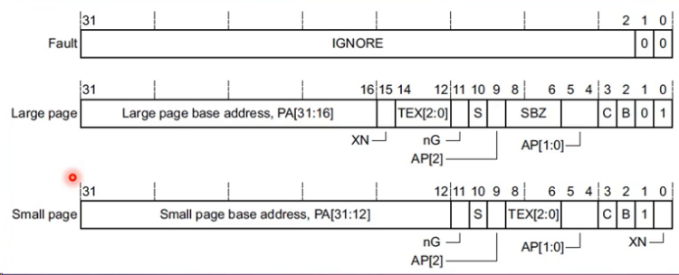

- bit0 禁止执行标志，1表示禁止执行，0表示可执行
- bit1 区分大页还是小页
- C/B bit: 内存区域属性
- TEX[2:0]：内存区域属性
- AP[1:0]: 访问权限
- S: 是否可共享
- nG: 用于TLB


### arm64

**ARMv8-A**架构

- 支持48根地址线
- 访问区域分成两部分（内核区和用户空间区），每个区域256TB
- 支持4KB，16KB和64KB的页，支持3级或者4级映射


ARMv8有两个页表基地址，一个用于用户区一个用于内核区，通过bit63来选择

**4KB大小页+4级映射**

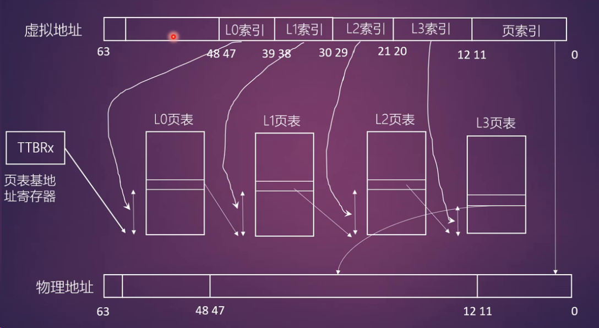

**TODO**

1. 总结页表相关操作的宏
2. start_kernel()->setup_arch()->paging_init()->map_lowmem() 

static void __init create_mapping(struct map_desc *md)

kernel image区域建立页表映射，线性映射区域建立页表映射

研究如何建立内核页表的映射

3. int remap_pfn_range() 研究如何由vma和虚拟地址以及物理地址pfn这些信息去建立页表映射的
4. static int do_anonymous_page 研究这个缺页中断函数来观察：知道了vma和虚拟地址vaddr以及页表项如何来设置用户进程的页表


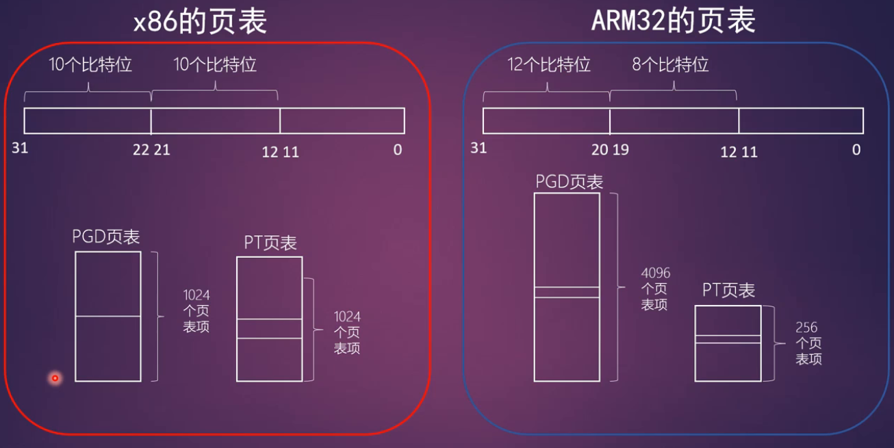


ARM32的实现方式：平行页表

两套页表，一套为了迎合硬件，一套为了迎合Linux内核

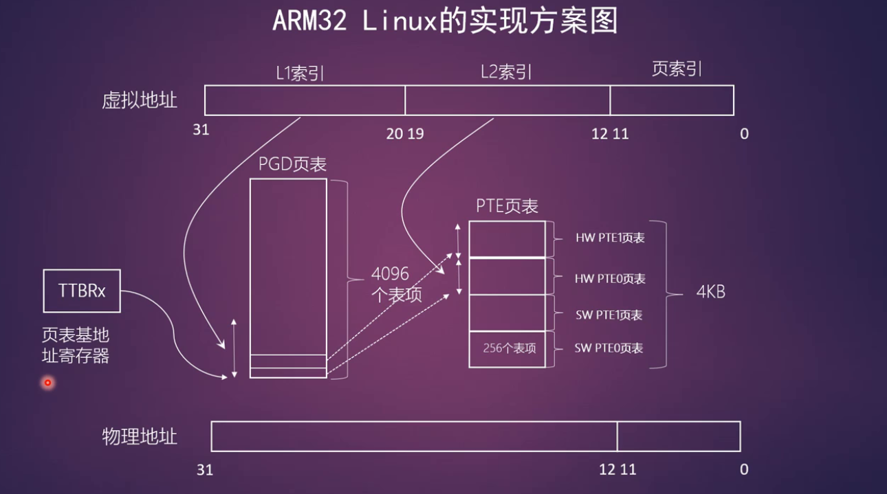


## 内存布局


**内存布局图**

内核空间：用户空间通常是1：3


## 页面分配机制

### 伙伴系统

- 伙伴算法是按2的幂次方大小进行分配内存块，这些内存被称为伙伴
- 何为伙伴
  - 两个块大小相同
  - 两个块地址连续
  - 两个块必须是同一个大块分离出来的


### 迁移类型

- 为了解决碎片化的问题，在伙伴系统中引入了迁移类型
  - MIGRATE_UNMOVABLE: 在内存中有固定位置，不能随意移动，比如内核分配的内存
  - MIGRATE_MOVABLE: 可以随意移动，用户态app分配内存
  - MIGRATE_RECLAIMABLE: 不能移动可以删除回收，比如文件映射
- **内存碎片化的产生**


page3是被内核自身分配的函数使用了，比如alloc_page(GPF_KERNEL)，所以它属于不可移动的页面，尽管其他页面都是空闲页面，page0到page7不能合成一块大的内存块


### 页面分配和分配掩码

页面核心分配函数

```C
struct page *alloc_pages(gfp_t gfp_mask,unsigned int order)
unsigned long __get_free_pages(gfp_t gfp_mask, unsigned int order)
alloc_page(gfp_mask)
```

**gfp_mask**标志位


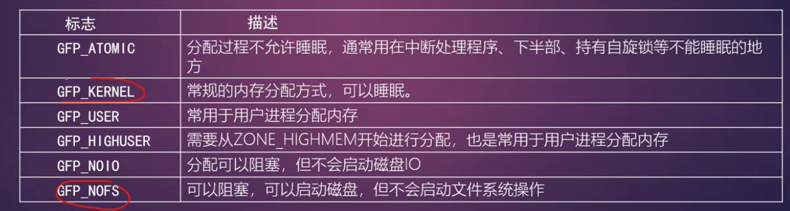

- 页面分配器是基于zone来设计的，因此页面的分配有必要确定哪些zone可以用作本次页面分配，系统会优先使用ZONE_HIGHMEM，然后才是ZONE_NORMAL
- 页面分配的时候也需要知道当前分配是要从哪个迁移类型中分配内存

**zone水位**

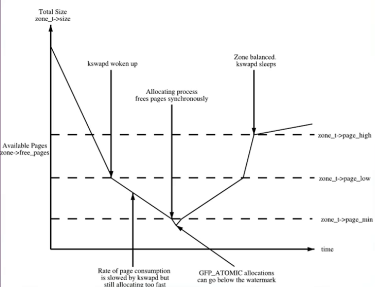

Linux内核中定义：
```c
enum zone_watermarks {
	WMARK_MIN,
	WMARK_LOW,
	WMARK_HIGH,
	NR_WMARK
};
```


页面释放函数

```C
void free_pages(unsigned long addr,unsigned int order)
__free_page(page)
 free_page(addr)
```

### per-cpu高速页面缓存

- 内核经常请求和释放单个页框，比如网卡驱动等等

- 页面分配器分配和释放页面的时候需要申请一把锁： zone->lock
  - 为了提高单个页框的申请和释放效率，内核建立了per-cpu页面高速缓存池
  - 其中存放了若干预先分配好的页框
- 当请求单个页框时，直接从本地cpu的页框高速缓存池中取出页框
  - 不必申请锁
  - 不必进行复杂的页框分配操作

（体现了预先建立缓存池的优势，而且是每个CPU有一个独立的缓存）

**per-CPU数据结构**

- zone中有一个成员pageset字段指向per-cpu的高速缓存
- struct per_cpu_pages数据结构

```c
struct per_cpu_pages {
	int count;		/* number of pages in the list */
	int high;		/* high watermark, emptying needed */
	int batch;		/* chunk size for buddy add/remove */

	/* Lists of pages, one per migrate type stored on the pcp-lists */
	struct list_head lists[MIGRATE_PCPTYPES];
};
```

## slab机制

当在内核中需要分配几十个字节的小块内存的时候，怎么办


```C

/*
 * Definitions unique to the original Linux SLAB allocator.
 */

struct kmem_cache {
	struct array_cache __percpu *cpu_cache;

/* 1) Cache tunables. Protected by slab_mutex */
	unsigned int batchcount;
	unsigned int limit;
	unsigned int shared;

	unsigned int size;
	struct reciprocal_value reciprocal_buffer_size;
/* 2) touched by every alloc & free from the backend */

	unsigned int flags;		/* constant flags */
	unsigned int num;		/* # of objs per slab */

/* 3) cache_grow/shrink */
	/* order of pgs per slab (2^n) */
	unsigned int gfporder;

	/* force GFP flags, e.g. GFP_DMA */
	gfp_t allocflags;

	size_t colour;			/* cache colouring range */
	unsigned int colour_off;	/* colour offset */
	struct kmem_cache *freelist_cache;
	unsigned int freelist_size;

	/* constructor func */
	void (*ctor)(void *obj);

/* 4) cache creation/removal */
	const char *name;
	struct list_head list;
	int refcount;
	int object_size;
	int align;

/* 5) statistics */
#ifdef CONFIG_DEBUG_SLAB
	unsigned long num_active;
	unsigned long num_allocations;
	unsigned long high_mark;
	unsigned long grown;
	unsigned long reaped;
	unsigned long errors;
	unsigned long max_freeable;
	unsigned long node_allocs;
	unsigned long node_frees;
	unsigned long node_overflow;
	atomic_t allochit;
	atomic_t allocmiss;
	atomic_t freehit;
	atomic_t freemiss;

	/*
	 * If debugging is enabled, then the allocator can add additional
	 * fields and/or padding to every object. size contains the total
	 * object size including these internal fields, the following two
	 * variables contain the offset to the user object and its size.
	 */
	int obj_offset;
#endif /* CONFIG_DEBUG_SLAB */
#ifdef CONFIG_MEMCG_KMEM
	struct memcg_cache_params memcg_params;
#endif

	struct kmem_cache_node *node[MAX_NUMNODES];
};

```

- array_cache：这里是指的per-CPU的对象缓存池，每个CPU一个
  - 用来建立本地对象缓存池，每个CPU一个，有利于：
    - 让对象尽可能的使用同一个CPU上的cache,有利于提高效率
    - 不需要额外的自旋锁，避免锁的争用

```c
/*
 * struct array_cache
 *
 * Purpose:
 * - LIFO ordering, to hand out cache-warm objects from _alloc
 * - reduce the number of linked list operations
 * - reduce spinlock operations
 *
 * The limit is stored in the per-cpu structure to reduce the data cache
 * footprint.
 *
 */
struct array_cache {
	unsigned int avail;
	unsigned int limit;
	unsigned int batchcount;
	unsigned int touched;
    // entry用来保存空闲对象的实体
	void *entry[];	/*
			 * Must have this definition in here for the proper
			 * alignment of array_cache. Also simplifies accessing
			 * the entries.
			 *
			 * Entries should not be directly dereferenced as
			 * entries belonging to slabs marked pfmemalloc will
			 * have the lower bits set SLAB_OBJ_PFMEMALLOC
			 */
};


#ifndef CONFIG_SLOB
/*
 * The slab lists for all objects.
 */
struct kmem_cache_node {
	spinlock_t list_lock;

#ifdef CONFIG_SLAB
	struct list_head slabs_partial;	/* partial list first, better asm code */
	struct list_head slabs_full;
	struct list_head slabs_free;
	unsigned long free_objects;
	unsigned int free_limit;
	unsigned int colour_next;	/* Per-node cache coloring */
	struct array_cache *shared;	/* shared per node */
	struct alien_cache **alien;	/* on other nodes */
	unsigned long next_reap;	/* updated without locking */
	int free_touched;		/* updated without locking */
#endif

#ifdef CONFIG_SLUB
	unsigned long nr_partial;
	struct list_head partial;
#ifdef CONFIG_SLUB_DEBUG
	atomic_long_t nr_slabs;
	atomic_long_t total_objects;
	struct list_head full;
#endif
#endif

};
```


- batchcount：表示当本地的对象缓存池为空时，需要从共享缓存池中获取batchcount个对象到本地缓存池
- limit: 当本地对象缓存池空闲数目大于limit时，需要释放一些对象
- shared: 用于多核系统
- size: 表示对象的长度
- flags: 对象分配掩码
- num: 一个slab中可以有多少个对象
- gfporder: 一个slab占用多个2的order次方的物理页面
- colour: 表示一个slab的有多个cache line用于着色
- freelist_size：每个对象要占用1字节来存放freelist
- name: 描述符的名称
- object_size：对象实际大小
- align: 对齐的长度


### 一个slab的组成


### slab运行机制

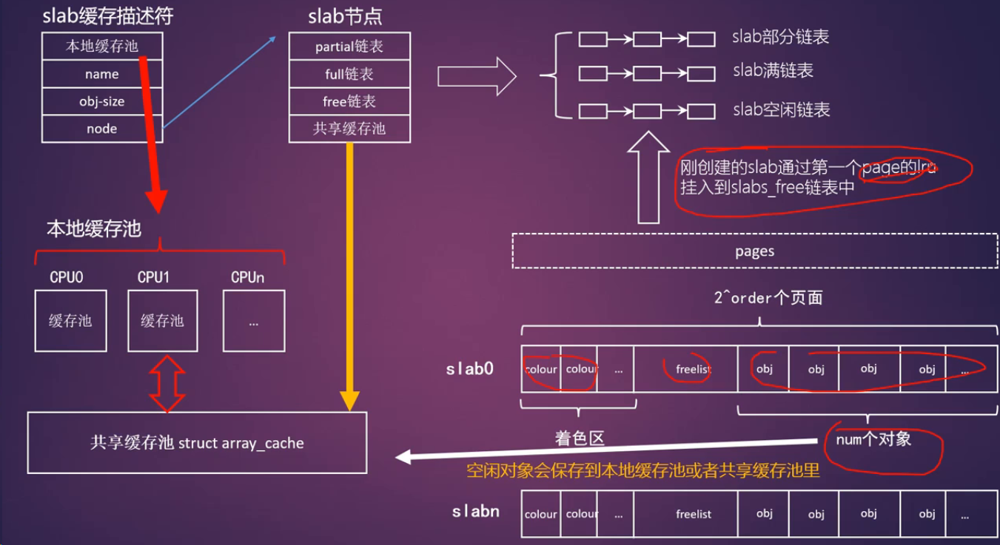

### slab的回收

- 如果一个slab描述符中有很多空闲对象，那么系统是否要回收一些空闲的缓存对象从而释放内存归还系统呢？
  - 使用kmem_cache_free释放一个对象，当发现本地和共享对象缓冲池中的空闲对象数目ac->avail大于等于缓冲池的极限值ac->limit时，系统会主动释放batchcount个对象
  - slab系统还注册了一个定时器，定时去扫描所有的slab描述符，回收一部分空闲对象


### kmalloc函数

- kmalloc()函数的核心是slab机制
- 按照内存块的2的order来创建多个slab描述符
  - void *kmalloc(size_t size, gfp_t flags)
  - void kfree(const void*)


## vmalloc


vmalloc接口函数

```c
void *vmalloc(unsigned long size);
void vfree(const void *addr);
```

vmalloc分配过程中是可以睡眠的，因此不能用在中断上下文中

## VMA操作


```C
struct vm_area_struct {
	/* The first cache line has the info for VMA tree walking. */

	unsigned long vm_start;		/* Our start address within vm_mm. */
	unsigned long vm_end;		/* The first byte after our end address
					   within vm_mm. */

	/* linked list of VM areas per task, sorted by address */
	struct vm_area_struct *vm_next, *vm_prev;

	struct rb_node vm_rb;

	/*
	 * Largest free memory gap in bytes to the left of this VMA.
	 * Either between this VMA and vma->vm_prev, or between one of the
	 * VMAs below us in the VMA rbtree and its ->vm_prev. This helps
	 * get_unmapped_area find a free area of the right size.
	 */
	unsigned long rb_subtree_gap;

	/* Second cache line starts here. */

	struct mm_struct *vm_mm;	/* The address space we belong to. */
	pgprot_t vm_page_prot;		/* Access permissions of this VMA. */
	unsigned long vm_flags;		/* Flags, see mm.h. */

	/*
	 * For areas with an address space and backing store,
	 * linkage into the address_space->i_mmap interval tree.
	 */
	struct {
		struct rb_node rb;
		unsigned long rb_subtree_last;
	} shared;

	/*
	 * A file's MAP_PRIVATE vma can be in both i_mmap tree and anon_vma
	 * list, after a COW of one of the file pages.	A MAP_SHARED vma
	 * can only be in the i_mmap tree.  An anonymous MAP_PRIVATE, stack
	 * or brk vma (with NULL file) can only be in an anon_vma list.
	 */
	struct list_head anon_vma_chain; /* Serialized by mmap_sem &
					  * page_table_lock */
	struct anon_vma *anon_vma;	/* Serialized by page_table_lock */

	/* Function pointers to deal with this struct. */
	const struct vm_operations_struct *vm_ops;

	/* Information about our backing store: */
	unsigned long vm_pgoff;		/* Offset (within vm_file) in PAGE_SIZE
					   units, *not* PAGE_CACHE_SIZE */
	struct file * vm_file;		/* File we map to (can be NULL). */
	void * vm_private_data;		/* was vm_pte (shared mem) */

#ifndef CONFIG_MMU
	struct vm_region *vm_region;	/* NOMMU mapping region */
#endif
#ifdef CONFIG_NUMA
	struct mempolicy *vm_policy;	/* NUMA policy for the VMA */
#endif
};
```


```C
struct vm_area_struct *find_vma(struct mm_struct *mm, unsigned long addr);
struct vm_area_struct * find_vma_intersection(struct mm_struct * mm, unsigned long start_addr, unsigned long end_addr);
struct vm_area_struct * find_vma_prev(struct mm_struct * mm, unsigned long addr,
					     struct vm_area_struct **pprev);
```


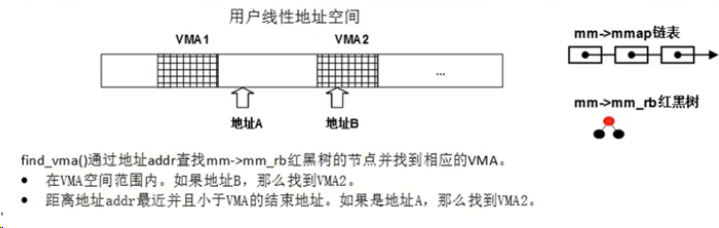

```c
int insert_vm_struct(struct mm_struct *mm, struct vm_area_struct *vma)
struct vm_area_struct *vma_merge(struct mm_struct *mm,
			struct vm_area_struct *prev, unsigned long addr,
			unsigned long end, unsigned long vm_flags,
			struct anon_vma *anon_vma, struct file *file,
			pgoff_t pgoff, struct mempolicy *policy)
```


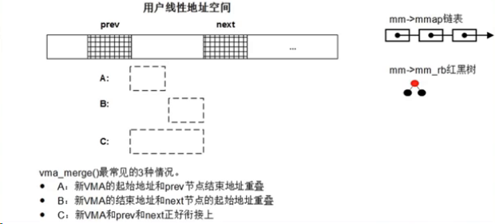

## malloc

- malloc 全称是memory allocation，中午名动态分配，用户空间主要用来分配虚拟内存的API
- calloc 在动态分配完内存后，自动初始化改内存空间为0，而malloc不初始化，里面的数据是随机的垃圾数据
- realloc 修改一个原先已经分配的内存块的大小，可以使一块内存的扩大或缩小


- malloc是c库封装的API，最终调用brk系统调用
- glibc里维护了一个小仓库，malloc函数的实现为用户进程维护了一个本地小仓库，当该进程需要使用更多的内存时就向这个小仓库要货，小仓库存量不足时就通过该代理商brk向内核批发
- malloc()想象成零售，那么brk就是代理商
- brk系统调用

```c
SYSCALL_DEFINE1(brk, unsigned long, brk)
```

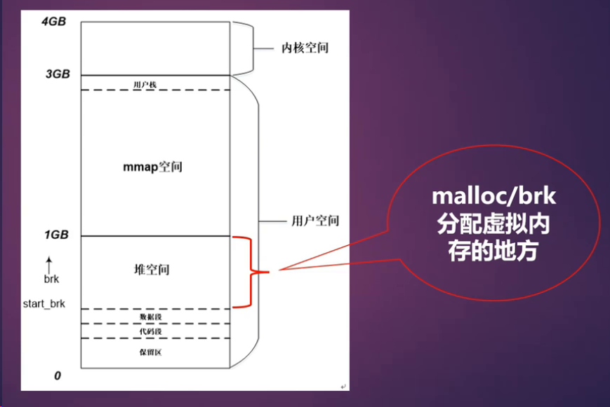

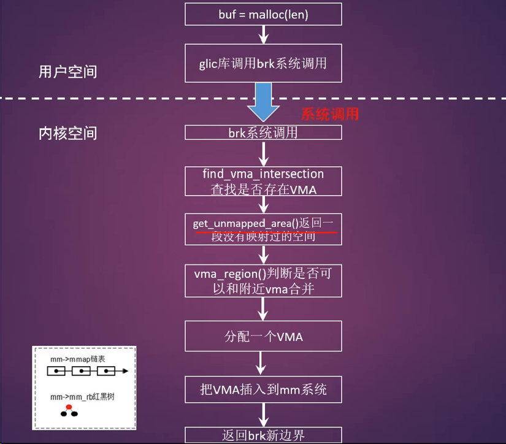

- 上图在进程的地址空间堆空间中查找一段空闲空间，然后创建一个VMA，然后就返回
- 按需分配（on-demand page）
  - malloc分配的内存可能长时间不使用，所以进程分配内存马上就分配物理空间其实不是一个好办法
  - 解决办法： 缺页中断，当进程真的需要访问这些虚拟页面的时候，情非得已才去创建物理内存

### mlock系统调用

- 系统调用mlock允许程序在物理内存上锁住它的部分或全部地址空间，调用mlock会马上为虚拟内存分配物理内存
- 将阻止Linux将这个内存页调度到交换空间(swap space)
- 在brk函数实现中，最后返回虚拟内存地址的时候，会去检查一个变量VM_LOCKED，这个VM_LOCKED通常从mlock系统调用中设置而来
  - 如果有，那么需要调用mm_populate()马上分配物理内存并建立映射
  - 一般情况是：一直将分配物理页面的工作推延到用户进程需要访问这些虚拟页面时，发生了缺页中断才会分配物理内存，并和虚拟地址建立映射关系


### get_user_pages()函数

- 一个很重要分配物理内存的接口函数，有很多驱动程序使用这个API来为用户态程序分配物理内存

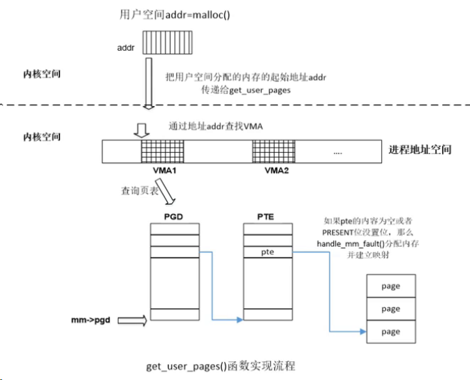

### follow_page()函数

- 返回用户进程地址空间VMA中已有映射过的normal mapping页面的struct page数据结构

### vm_normal_page()函数

- 该函数把page页面分为两个阵营，一个是normal page，另一个是special page
  - normal page通常指正常mapping的页面，比如匿名页面,page cache和共享内存页面
  - special page通常指不正常mapping的页面，这些页面不希望参与内存管理的回收或者合并的功能，例如映射如下特性的页面：
    - VM_IO : 为I/O设备映射内存
    - VM_PEN_MAP : 纯PFN映射
    - VM_MIXEDMAP : 固定映射

### 总结

- malloc函数其实是为用户空间分配进程地址空间，用内核术语来说就是分配一块VMA，相当于一个空的纸箱子，那么什么时候往箱子里装东西？两种方式：
  - 一种是到了真正使用箱子的时候才往里面装东西
  - 另一种是分配箱子的时候就装了你想要的东西
- 两个进程的malloc分配的虚拟地址是一样的，会打架吗？
  - 每个用户进程有自己的一份页表，每个进程有一个mm_struct数据结构，包含一个属于进程自己的页表，一个管理VMA的红黑树和链表
  - 即使进程A和进程B使用malloc分配内存返回的相同的虚拟地址，但其实他们是两个不同的VMA，分别被不同的两套页表来管理

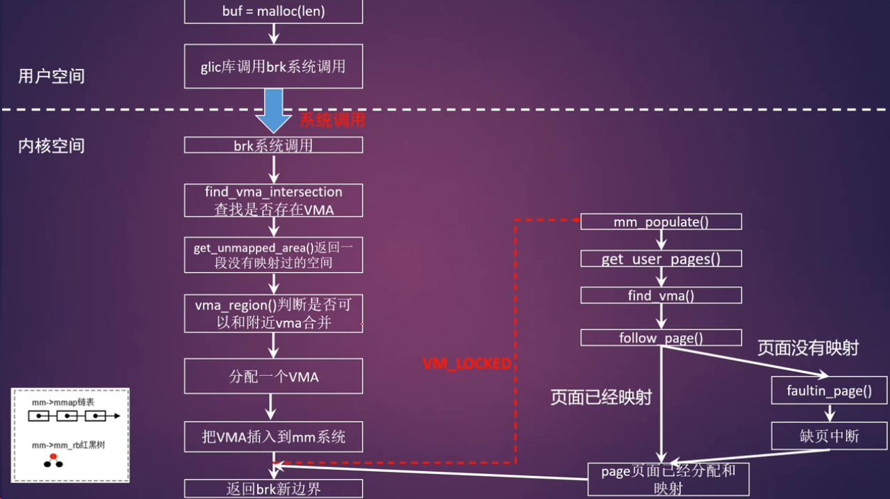

## mmap

```c
#include <sys/mman.h>
void *mmap(void *addr,size_t length,int prot,int flags,int fd,off_t offset);
int munmap(void *addr,size_t length);
```

- addr : 用于指定映射到进程地址空间的起始地址，为了应用程序的可移植性，一般设置为NULL，让内核选择一个合适的地址
- length: 表示映射到进程地址空间的大小
- prot : 用于设置内存映射区域的读写属性
  - PROT_EXEC：表示映射的页面是可以执行的
  - PROT_READ：表示映射的页面是可以读取的
  - PROT_WRITE：表示映射的页面是可以写入的
  - PROT_NONE: 表示映射的页面是不可访问的
- flags：用于设置内存映射的属性，例如共享映射，私有映射等
  - MAP_SHARED: 创建一个共享映射的区域，多个进程可以通过共享映射的方式来映射一个文件，这样其他进程也可以看到映射内容的改变，修改后的内容会同步到磁盘文件中
  - MAP_PRIVATE: 创建一个私有的写时复制的映射，多个进程可以通过私有映射的方式来映射一个文件，这样其他进程不会看到映射内容的改变，修改后的内容也不会同步到磁盘文件里
  - MAP_ANONYMOUS: 创建一个匿名映射，即没有关联到文件的映射
  - MAP_FIXED: 使用参数addr创建映射，如果在内核中无法映射指定的地址addr，那么mmap会返回失败，参数addr要求按页对齐。如果addr和length指定的进程地址空间和已有的VMA区域重叠，那么内核会调用do_munmap()函数把这段重叠的区域销毁，然后重新映射新的内容
  - MAP_POPULATE: 对于文件映射来说，会提前预读文件内容到映射区域，该特性只支持私用映射。
- fd： 表示这是一个文件映射，fd是打开的文件句柄
- offset： 在文件映射时，表示文件偏移量


### 文件映射和匿名映射

- 匿名映射： 没有映射对应的相关文件，这种映射的内存区域的内容会被初始化为0
- 文件映射：映射和实际文件相关联，通常是把文件的内容映射到地址空间，这样应用程序可以像操作系统进程空间一样读写文件

### 私有映射和共享映射

- 私有映射： 创建的映射只能自己看到，其他的进程不能看到映射内容的改变
- 共享映射：创建的映射其他进程可以看到映射内容的改变，如果以共享的方式打开一个文件的话，修改后的内容会同步到磁盘文件中


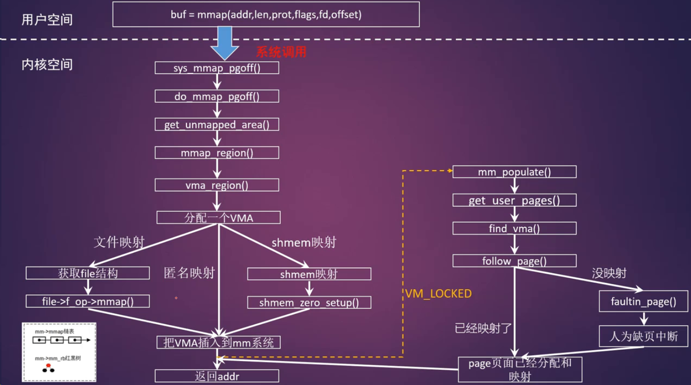

## 缺页中断

- 分页机制

  - MMU
  - 页表项中的PTE_PRESENT比特位

  

- ARM32的MMU中有如下两个与存储访问失效相关的寄存器
  - 失效状态寄存器（Data Fault Status Register, FSR）
  - 失效地址寄存器（Data Fault Address Register, FAR）

- ARMv7汇编处理流程为 **vectors_start  ->  vector_dabt  ->  datb_user / dabt_svc -> dabt_helpper -> v7_early_abort** 

- struct fsr_info数据结构用于描述一条失效状态对应的处理方案
- fs_info[]数组列出了常见的地址失效处理方案

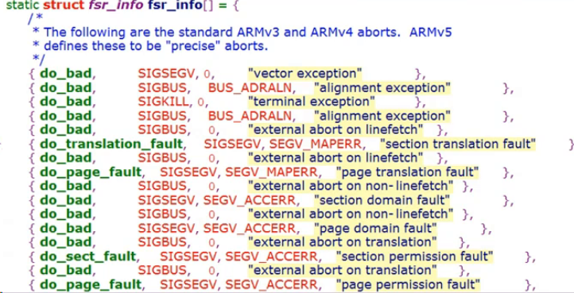

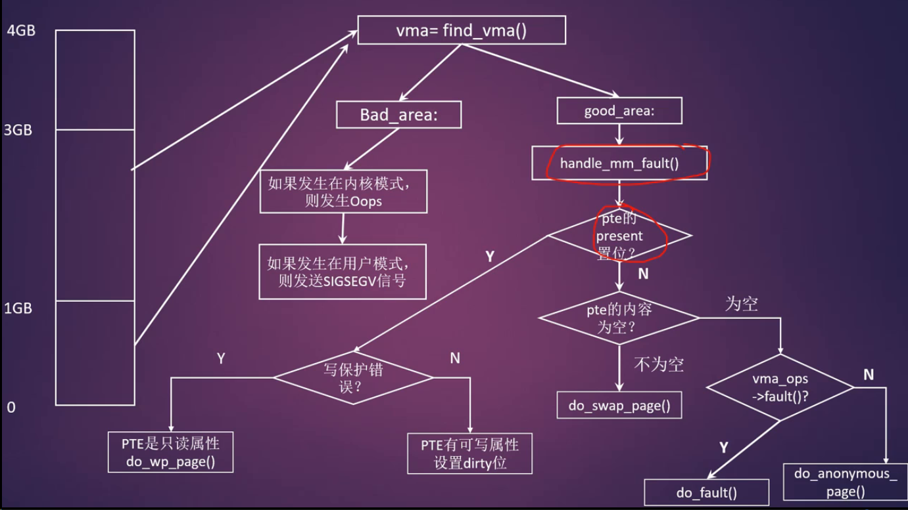

- 问题1：什么是匿名页面？

  - 在Linux内核中没有关联到文件映射的页面称为匿名页面（Anonymous Page,简称anon page）。比如malloc分配的页面

- 问题2：为什么需要匿名页面的缺页中断？

  - 如果没有匿名页面缺页中断，那么你在用户空间使用malloc()这个API来分配虚拟内存，那么在内核中都需要实实在在的为其分配物理内存。主要的问题就是浪费，因为很多时候应用程序分配虚拟内存并不会马上使用，所以没有必要马上就满足应用程序的需求

- 问题3：匿名页面缺页中断发生的条件是什么?

  - 当pte页表项中PRESENT没有置位
  - pte内容为空
  - 没有指定vma->vm_ops->fault()函数指针

  满足上述三个条件我们就判断现在是匿名页面缺页中断了，处理函数是：do_anonymous_page

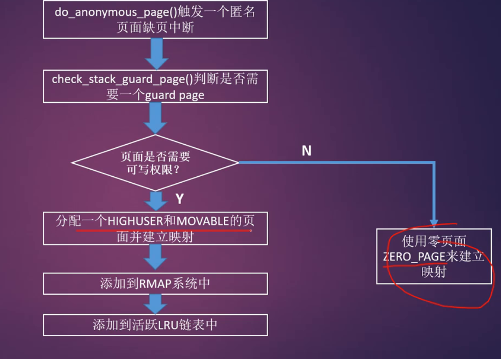

- 问题1：什么是文件映射？
  - 和文件相连的映射，其实就是文件映射，这个是和匿名映射相对应的。把文件的内容映射到进程地址空间里面
- 问题2：哪些类型的映射会产生文件映射的缺页中断？
  - 对应的文件映射主要是普通文件的映射，比如视频播放器读取一个视频文件
  - 还有一种情况就是，设备驱动通过mmap把设备DMA buffer映射到进程地址空间里
- 在handle_pte_fault()函数里怎么判断是文件映射
  - 当页面不在内存
  - 页表项内容为空
  - VMA定义了fault方法函数(vma->vm_ops->fault())


**写缺页中断**

- 写缺页中断是最复杂的情况，也是最常用的情形
- 写时复制技术(COW)
  - 在fork子进程的时候，内核不需要复制父进程的整个用户空间内容给予子进程而是让父子进程共享父进程的地址空间，这样就省去了非常耗时的拷贝动作，而仅仅是拷贝页表即可
  - 当父子进程有一方需要写入的时候，数据才会被复制，从而父子进程才会拥有各自的副本。所以，这里的do-wp-page函数就是处理这种共享问题
- do_wp_page()的判断条件是什么
  - 当PTE_PRESETN位 置位 了然后缺页处理flags标志位是显示写保护错误（这个写保护错误，通常硬件是会报告的）

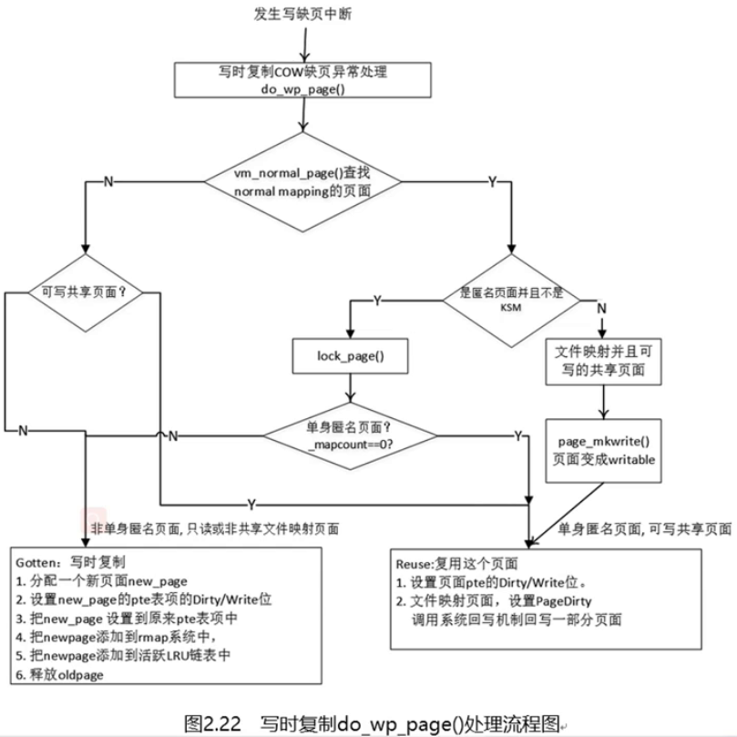

- 总的来说，这个过程相当复杂，需要处理很多种情况：
  - normal mapping页面和special mapping页面
  - 纯粹的匿名页面，这个名词是编造的，也就是剔除了KSM的匿名页面
  - 单身匿名页面，这个名词也是编造的，就是只有一个进程的虚拟页面映射了这个匿名页面，即mapcount=0
  - 非单身匿名页面
  - 可写共享匿名页面，这个通常指的是具有可写属性，并且是share的页面，通常是page cache


**总结**

- 缺页中断发生后，根据pte页表项的PRESETN位，pte内容是否为空(pte_none()宏)以及是否文件映射等条件，相应的处理函数如下：
  - 匿名页面缺页中断 do_anonymous_page()
    - 判断条件
      - pte页表项中PRESENT没有置位
      - pte内容为空
      - 没有指定vma->vm_ops->fault()函数指针
    - 应用场合： malloc()分配内存
  - 文件映射缺页中断do_fault()
    - 判断条件
      - pte页表中的PRESENT没有置位
      - pte内容为空且制定了vma->vm_ops->fault()函数指针
      - do_fault()属于在文件映射中发生的缺页中断的情况
      - 如果仅发生读错误，那么调用do_read_fault()函数去读取这个页面
      - 如果在私有映射VMA中发生写保护错误，那么发生写时复制，新分配一个页面new_page，旧页面的内容要复制到新页面中，利用新页面生成一个PTE entry并设置到硬件页表项中，这就是所谓的写时复制COW
      - 如果写保护错误发生在共享映射VMA中，那么就产生了脏页，调用系统的回写机制来回写这个脏页
    - 应用场景：
      - 使用mmap读文件内容，例如驱动中使用mmap映射设备内存到用户空间
      - 动态库映射，例如不同的进程可以通过文件映射来共享一个动态库
  - swap缺页中断do_swap_page()
  - 写时复制COW缺页中断do_wp_page()
    - do_wp_page()最终处理有两种情况
      - resue复用old_page： 单身匿名页面和可写的共享页面
      - gotten写时复制：非单身匿名页面，只读或者非共享的文件映射页面
    - 判断条件：pte页表项中的PRESENT置位了且发生写错误缺页中断
    - 应用场景：fork, 父进程fork子进程，父子进程都共享父进程的匿名页面，当其中一方需要修改内容时，COW便会发生

## pages数据结构

当开启了MMU之后，CPU访问内存的最小单位为页(Page)


- flag标志：PG_*标志位
  - 定义在include/linux/page-flags.h


arm vexpress平台

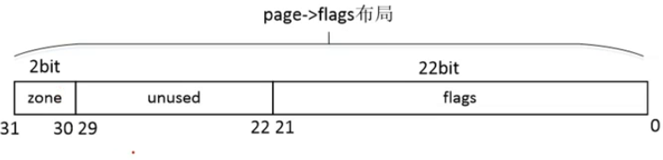

- _count字段
  - 当_count的值为0时，表示该page页面为空闲或即将要被释放的页面
  - 当_count的值为0时，表示该page页面已经被分配且内核正在使用，暂时不会被释放

```C
static inline void get_page(struct page *page);
void put_page(struct page *page);
#define page_cache_get(page)  get_page(page)
#define page_cache_release(page) put_page(page)
```

- _mapcount字段

  _mapcount引用技术表示这个页面被进程映射的个数，即已经映射了多少个用户pte页表。在32位Linux内核中，每个用户进程都拥有3GB的虚拟空间和一份独立的页表，所以有可能出现多个用户进程地址空间同时映射到一个物理页面的情况，RMAP反向映射系统就是利用这个特性来实现的。\_mapcount引用计数主要用于RMAP反向映射系统中。

  - _mapcount==-1 表示没有pte映射到页面
  - _mapcount==-1 表示只有父进程映射到了页面。匿名页面刚分配时，\_mapcount引用计数初始化为0

使用：

- 内核代码不会直接去检查count和mapcount的个数，而是采用两个宏
- static inline int page_mapcount(struct page *page)
- static inline int page_count(struct page *page)


- mmaping 字段
  - 当这个页面用于文件缓存即page cache时候，mapping指向和这个page cache相关联的address_space对象，这个address_space对象是属于内存对象（比如索引节点的页面集合）
  - 当这个页面用于匿名页面（Anonymous Page）的时候，mapping指向一个anon_vma数据结构，主要是用于反向映射(Reverse Mapping)
- lru字段
  - 用在页面回收的LRU链表算法中，LRU链表算法定义了多个链表
  - 用来把一个slab添加到slab满链表，slab空闲链表和slab部分链表中
- virtual字段
  - 一个指向页所对应的虚拟地址的指针


- struct page的意义
  - 内核知道当前这个页面的状态（通过flags字段）
  - 内核需要知道一个页面是否空闲即有没有分配出去，有多少个进程或者内存路径使用了这个页面（使用count和mapcount引用计数）
  - 内核知道了谁在使用了这个页面，比如使用者是通过用户空间进程的匿名页面还是page cache？（通过mapping字段）
  - 内核知道这个页面是否被slab机制使用（通过lru,s_mem等字段）
  - 内核知道这个页面是否线性映射（通过virtual字段）

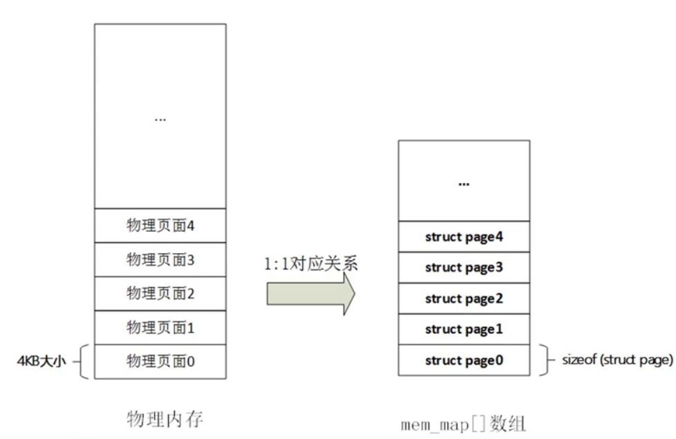

- 页面锁PG_Locked
  - struct page数据结构成员flags定义了一个标志位PG_locked，内核通常利用PG_locked来设置一个页面锁
    - lock_page()函数用于申请页面锁，如果页面锁被其他进程占用了，那么就会睡眠等待
    - trylock_page()如果返回false表示获取锁失败，返回true表示获取锁成功
    - trylock_page()不会去睡眠等待，只是用来做一下判断


## RMAP 反向映射机制

- 正向映射

  - 从虚拟地址到物理地址，沿着MMU硬件的脚步

  

- 当物理内存短缺时？
  - 虚拟内存常常大于物理内存
  - 把暂时不用的物理内存swap到交换分区
- 如何判断哪些物理内存暂时不用？
  - LRU算法
  - 第二次机会法
- Linux 2.4内核的做法
  - 遍历所有进程的VMA来确定某个物理页面映射的pte
- 反向映射的设计目标：


反向映射用到的数据结构：

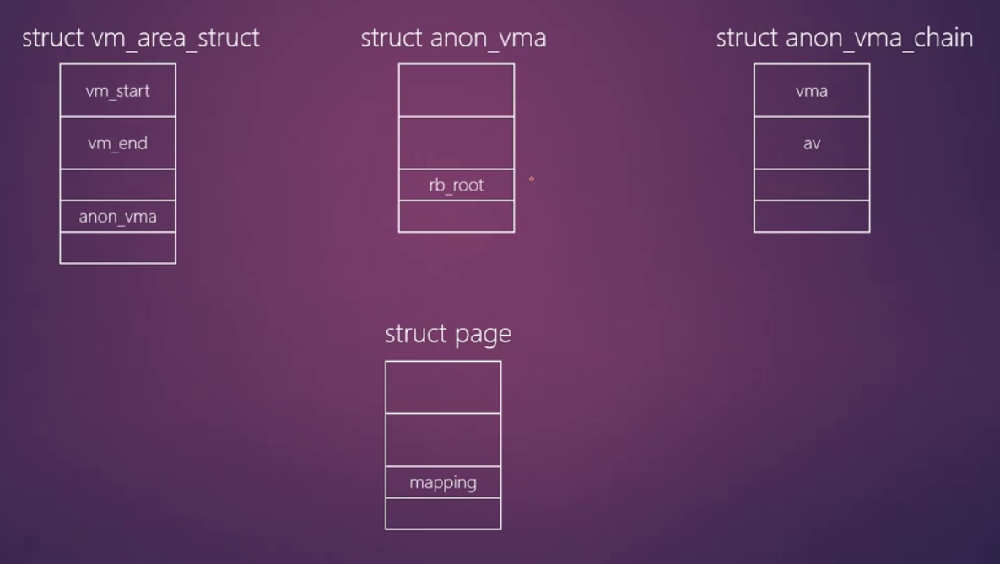

RMAP四部曲（以Linux 2.6.11为例）

1. 父进程分配匿名页面

   1. do_anonymous_page()->page_add_anon_rmap()
   2. page_add_anon_rmap()
      1. page->mapping指向VMA的anon_vma数据结构
      2. 计算page->index

2. 父进程创建子进程

   1. do_fork()->copy_mm()->dump_mm()，把父进程所有的VMA复制到子进程对应的VMA中
   2. anon_vma_link(): 把子进程的VMA加入到父进程的vma->anon_vma->head链表中

3. 子进程发生COW

   1. 当父子进程共享匿名页面，子进程的VMA发生COW

   缺页中断->handle_pte_fault()->do_wp_page()->分配一个新的匿名页面->page_add_anon_rmap()

   新分配的匿名页面page->mapping指向父进程vma->anon_vma

4. RMAP应用

   1. 页面回收：断开所有映射的用户PTE才能回收页面
   2. 页面迁移：断开所有映射的用户PTE


缺陷：


优化，降低锁的粒度


- 反向映射总结
  - 提高页面回收效率
  - 消耗一定内存空间，典型的以空间换时间
  - 连接虚拟内存管理和物理内存管理的一个桥梁

## 页面回收

- 页面置换（page replacement）
- 页面回收（page reclaim）
- 页面置换其他例子
  - 处理器高速缓存cache
  - web服务器


- 页面回收算法介绍
  - 最优页面置换算法
  - 先进先出页面置换算法
  - 最近未使用页面置换算法
  - LRU算法（最近最少使用页面置换算法Least Recently Used）
    - 利用局部性原理
    - 维护链表
    - 新页面加入到链表头部
    - 每当链表中的页面被访问，该页面加入到链表头部
    - 每当需要页面置换的时候，从链表尾部取页面
  - 第二次机会法
    - 给页面第二次可以被访问的机会
  - 时钟页面置换算法
  - 工作集算法


- Linux内核中使用的页面回收算法
  - LRU链表
    - 不活跃匿名页面链表 LRU_INACTIVE_ANON
    - 活跃匿名页面链表LRU_ACTIVE_ANON
    - 不活跃文件映射页面链表LRU_INACTIVE_FILE
    - 活跃文件映射页面链表LRU_ACTIVE_FILE
    - 不可回收页面链表LRU_UNEVICTABLE


- LRU基于zone实现的。每个zone有一套完整的LRU链表


- 第二次机会法
  - LRU算法缺点：没有考虑该页面的频繁使用的情况，页面依然会被踢出LRU链表
  - 第二次机会法：
    - 设置了一个访问状态位（硬件控制的比特位）
    - 要检查页面的访问位
      - 如果是0，立刻踢出LRU链表
      - 如果是1，表示这期间又被访问过了，这时清除这个访问状态位，然后把这个页面重新添加到链表头，和新加入的页面一样
  - Linux内核使用如下几个状态位来实现第二次机会法：
    - PTE_YONG 硬件比特位，当一个页面被访问过，硬件会自动设置这个比特位
    - PG_active 软件比特位
    - PG_referenced 软件比特位


**Linux页面回收框图**

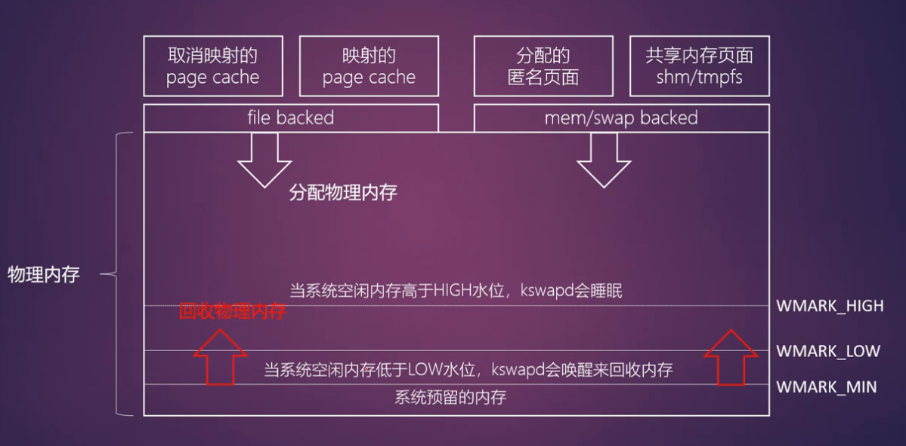

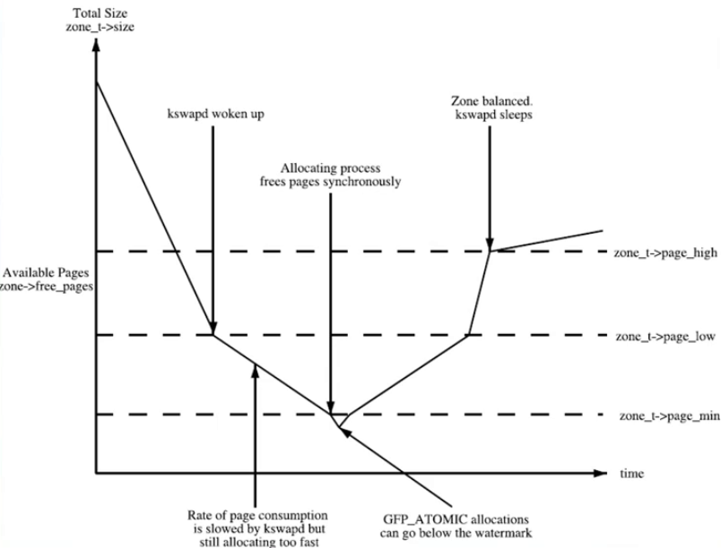


匿名页面回收过程：


page cache的页面回收流程


**LRU链表的迁移**

- LRU链表可以在活跃链表和不活跃链表中迁移
- 主要使用的软硬件比特位
  - PTE_YONG: 硬件比特位，当一个页面被访问过，硬件会自动设置这个比特位
  - PG_active： 软件比特位
  - PG_referenced: 软件比特位
- 主要辅助函数
  - mark_page_accessed(): 主要是用来标记页面已经被访问了，然后设置PG_active和PG_referenced
  - page_referenced():判断page是否被访问引用过，返回的访问引用pte的个数，利用反向映射RMAP系统来统计访问引用pte的个数
  - page_check_references()


**kswapd内核线程**

- 负责在内存不足的时候异步回收页面
- 每个NUMA内存节点创建一个kswapd内核线程
- alloc_pages()在低水位(ALLOC_WMARK_LOW)中无法分配出内存，这时分配内存函数会调用wakeup_kswapd()来唤醒kswapd内核线程

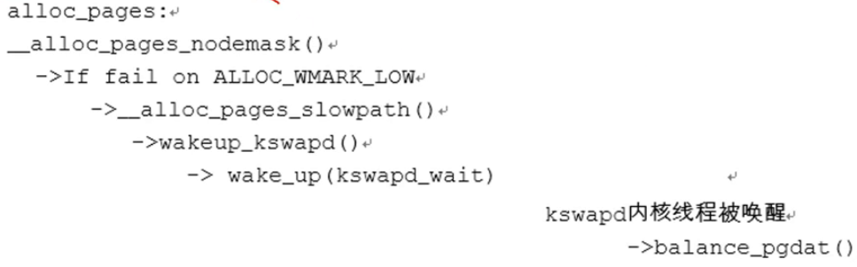

- 当zone处于高水位时会让kswapd睡眠


**页面回收详细流程图**

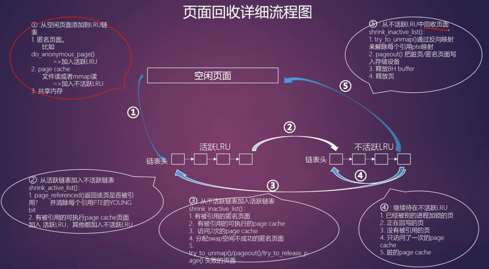


## 匿名页面的生命周期

- maclloc/mmap接口分配的内存->do_anonymous_page()
- 写时复制：当缺页中断出现写保护错误时，新分配的页面是匿名页面
- do_swap_page() 从swap分区读回数据时会新分配匿名页面
- 迁移页面


**分配**

- do_anonymous_page()分配一个匿名页面anon_page为例子，anon_page刚分配的状态如下：
  - page->_count = 1
  - page->_mapcount=0
  - 设置PG_swapbacked标志位
  - 加入LRU_ACTIVE_ANON链表里
  - page->mapping指向VMA中的anon_vma数据结构

**使用**

- 匿名页面在缺页中分配完成之后，就建立了进程虚拟地址空间VMA和物理页面的映射关系，用户进程访问虚拟地址即访问到匿名页面的内容

**换出**

- 活跃链表->不活跃链表

- 第一次扫描不活跃链表

  - add_to_swap()函数会为该页分配swap分区空间

  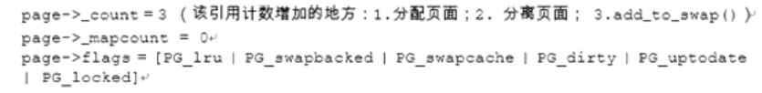

  - try_to_unmap()

  

  - pageout()

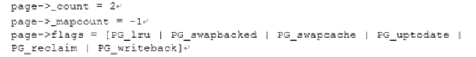

- 第二次扫描不活跃链表

  - 假设第二次扫描不活跃链表时，该页写入swap分区已经完成。Block layer层的回调函数end_swap_bio_write()->end_page_writeback()会完成如下动作：

    - 清除PG_writeback标志位
    - 唤醒等待在该页PG_writeback的线程，见wake_up_page(page,PG_writeback)函数

  - shrink_page_list()->__remove_mapping()函数作用如下

    - page_freeze_refs(page,2)判断当前page->_count是否为2，并且将该计数设置为0
    - 清PG_swapcache标志位
    - 清PG_locked标志位

    

最后把page加入free_page链表中，释放该页，因此该anon_page页的状态是页面的内容已经写入swap分区，实际物理页面已经释放

**匿名页面的换入**

- 匿名页面被换出到swap分区后，如果应用程序需要读写这个页面，缺页中断发生，因为pte中的present比特位显示该页不在内存中，但pte表项不为空，说明该页在swap分区中，因此调用do_swap_page()函数重新读入该页的内容

**匿名页面的释放**

- 当用户进程关闭或者退出时，会扫描这个用户进程所有的VMAs，并会青醋这些VMAs，如果符合释放标准，相关页面会被释放

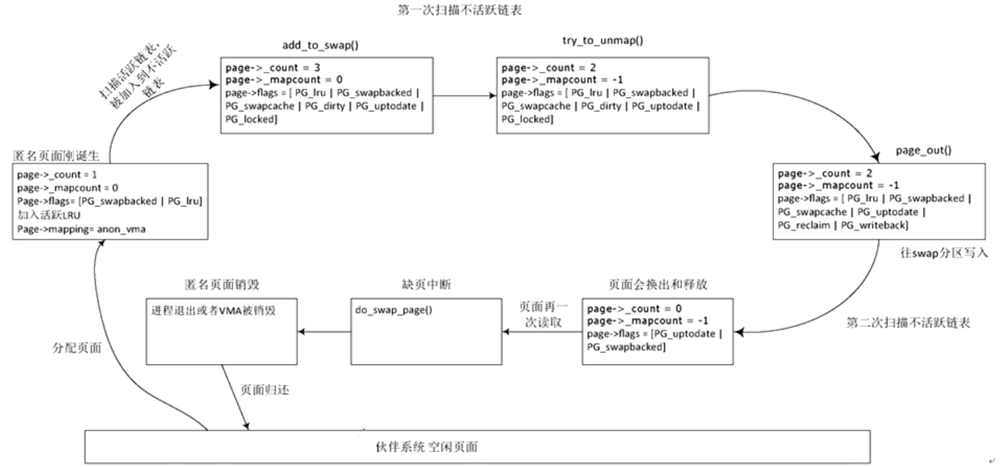

## 页面迁移

**NUMA**:Non-Uniform Memory Access 非统一内存访问

- 每个处理器有**自己的本地内存（Node Local Memory）**。

- 也可以访问其他处理器的内存（Remote Memory），但速度更慢。

- 常见于**多路服务器、大型多核系统**。

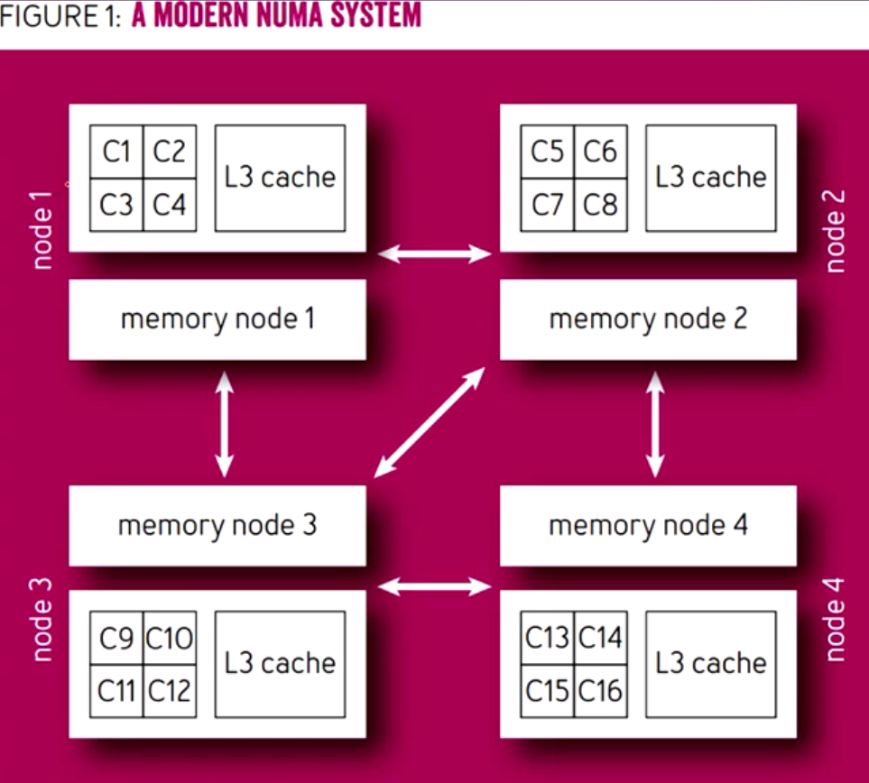


**UMA**:Uniform Memory Access 统一内存访问

- **所有处理器共享一块物理内存**。

- **访问速度一致**，也就是 **访问任意内存的延迟是相同的**。

- 常见于**小型多核系统**、**对称多处理器系统（SMP）**。


**libnuma**

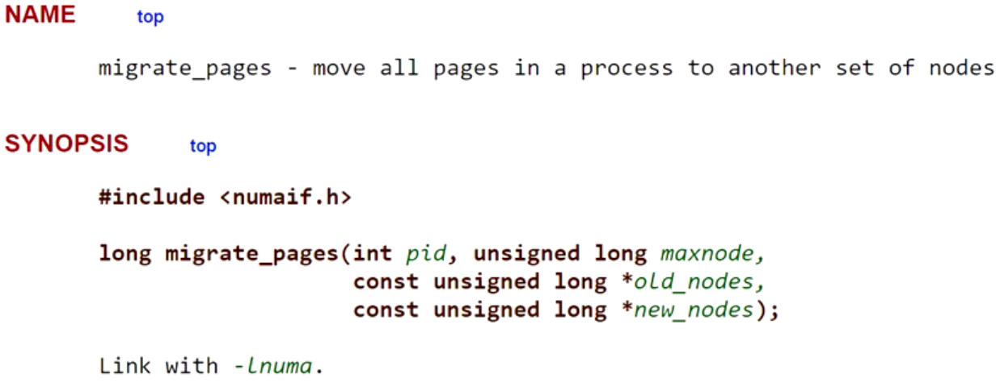

迁移一个进程的所有页面从一个内存结点到另外一个内存结点

pid 进程的PID

maxnode: node的最大数量

old_nodes: 指向nodes的一个bit mask，这是进程所在的nodes

new_nodes: 指向要迁移目的地的一个node mask

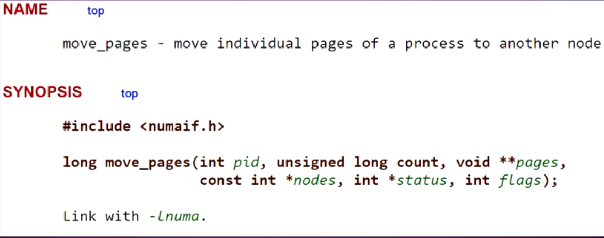

迁移进程的部分页面到新的内存结点


**migrae_pages**


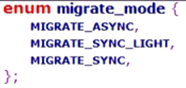

MIGRATE_ASYNC 异步模式，不会阻塞

MIGRATE_SYNC 同步模式，过程会阻塞


**页面迁移的流程**


## 内存规整

**memory compaction**

内存碎片换产生的原因

- Linux内核的物理内存是由伙伴系统来管理的
- 伙伴系统由11个2的order次方的链表组成,order从0~10
- 伙伴系统有切蛋糕的习惯
- 伙伴系统可以有神奇的修复功能

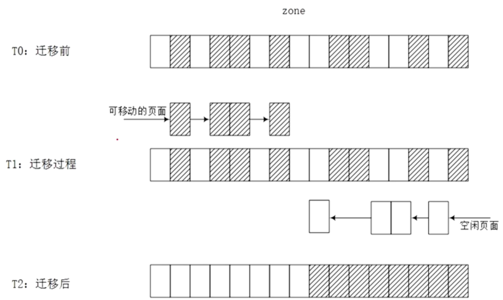


## KSM


**如何使用KSM**

- 使能KSM:
  - madvise(addr,length,MADV_MERGEA_BLE)
- 关闭KSM:
  - madvise(addr,length,MADV_UNMERGEABLE)
- android的bionic库中的mmap函数默认打开了KSM

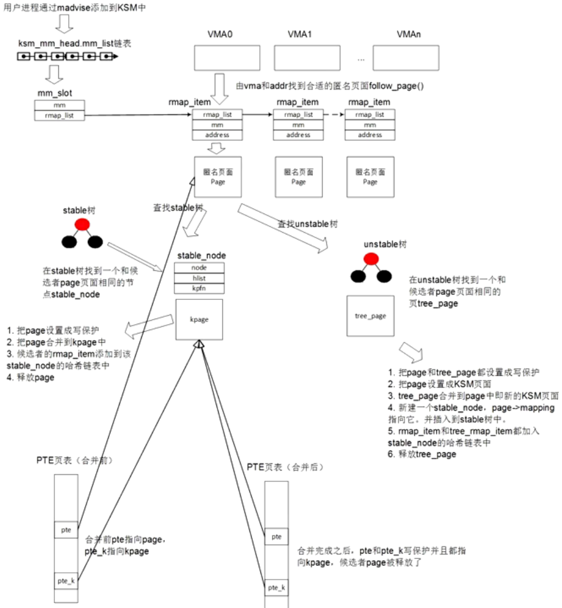

**KSM的统计计数**

- run : 这个结点写1，表示启动ksmd内核线程，写0表示要停止ksmd内核线程
- pages_to_scan：单次扫描的页数，ksmd内核线程每次被唤醒之后，会扫描多少个页面
- sleep_millisecs: ksmd在下一次扫描前睡眠多长时间，单位毫秒
- pages_shared: 共享的页面数，如果1000个页面均为同一个内容，然后合并成一个页面，这里pages_shared等于1
- pages_sharing: 可共享的页面数，如果1000个页面合并成一个页面，那么pages-sharing就是1000
- pages_unshared：当前没有合并的页面数量，通常是unstable页面的数量
- full_scans：从头到尾扫描的次数
